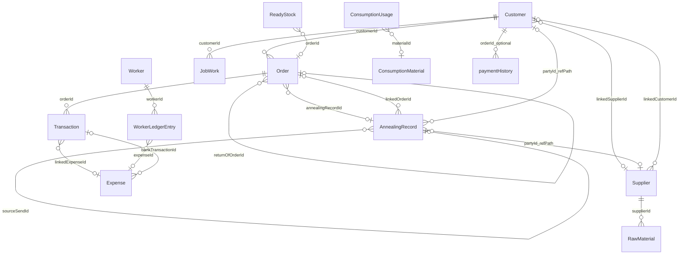
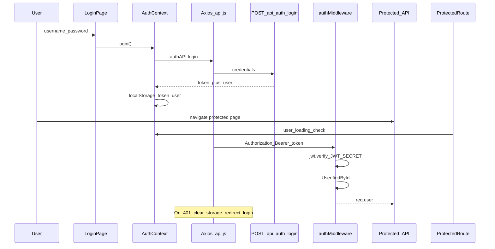

# Wire Manufacturing System (WMS) — Project Documentation

Generated from the actual codebase under `WMS/backend` and `WMS/frontend`.  
Excluded from the file tree: `node_modules/`, frontend `build/`, and `_db_backup/` contents.

---

## 1. What This Project Is and What It Does

**WMS** is a Wire Manufacturing Management System for a coil-to-wire factory.

| Layer | Package | Stack |
|-------|---------|-------|
| Backend | `wire-manufacturing-backend` v1.0.0 | Node.js, Express, Mongoose/MongoDB, JWT (`jsonwebtoken` + `bcryptjs`) |
| Frontend | `wire-manufacturing-frontend` v1.0.0 | React 18 (Create React App), Material UI 5, React Router 6, Axios, Recharts, jsPDF, xlsx |

**What it does (from code):**

- Track **suppliers** and **coil stock** (Shiplet Coil / Patri Coil), including coil returns and low-stock alerts (&lt; 1000 kg per category).
- Track **customers** (Ledger / Daily / Processing), **wire sales/orders**, wire returns, and party ledgers.
- Run a **Daily Book**: cash book, bank transfers, daily sales, customer/supplier payments, annealing send/arrival, processing (job work) receive/deliver.
- Track **expenses** by factory groups and self-expense categories; **process materials** (Acid, Dye, Soap, Stationary); **workers** with salary/advance ledgers linked to expenses.
- Track **ready (finished) wire stock**, **annealing pools**, and **bank account openings**.
- Provide **dashboard KPIs/charts** and **management reports** (P&amp;L, financial, inventory, daily-book report).
- Authenticate users with **JWT Bearer** tokens. All `/api/*` routes except `/api/auth/login` require auth (profile/change-password also require JWT).

Default API base: `http://localhost:5000/api`. Default server port: `5000`.

---

## 2. Complete Folder and File Tree

### 2.1 Root

```
WMS/
├── backend/                  Express API + MongoDB models
├── frontend/                 React SPA
└── PROJECT_DOCUMENTATION.md  This file
```

### 2.2 Backend (`backend/`)

| Path | Purpose |
|------|---------|
| `package.json` | Backend package metadata and scripts (`start`, `dev`, `seed`) |
| `package-lock.json` | Locked dependency versions |
| `.env.example` | Documents `PORT`, `MONGODB_URI`, `JWT_SECRET`, `JWT_EXPIRES_IN`, `NODE_ENV` |
| `server.js` | App entry: CORS, JSON body, mounts all `/api/*` routes, global error handler, startup stock reconcile |
| `seed.js` | Seeds default users (`dad`, `uncle`, `admin`) if none exist |
| `config/db.js` | Connects Mongoose using `process.env.MONGODB_URI` |
| `middleware/authMiddleware.js` | Verifies `Authorization: Bearer <JWT>`, attaches `req.user` |
| `middleware/errorHandler.js` | Global Express error handler; includes stack when `NODE_ENV === 'development'` |

#### Controllers

| Path | Purpose |
|------|---------|
| `controllers/authController.js` | Login, profile, change password |
| `controllers/supplierController.js` | Supplier CRUD, ledger, purchases; delete guard if history exists |
| `controllers/rawMaterialController.js` | Coil purchase/return, stock summary, low stock, reconcile pending orders |
| `controllers/customerController.js` | Customer CRUD, ledger, payments, orders; delete guard if history exists |
| `controllers/orderController.js` | Wire orders, stock check, status/final weight, wire returns |
| `controllers/transactionController.js` | Daily Book transactions, cash book, bank book/openings |
| `controllers/expenseController.js` | Expense CRUD, summary, breakdown |
| `controllers/reportController.js` | Profit/loss, financial, customer, inventory, daily-book reports |
| `controllers/dashboardController.js` | Dashboard stats and charts |
| `controllers/consumptionController.js` | Process material purchases/usage/analysis |
| `controllers/readyStockController.js` | Finished wire production list/summary/create/delete |
| `controllers/configController.js` | Returns wire definitions from `wireConfig` |
| `controllers/annealingController.js` | Annealing send/arrival/sold pools and CRUD |
| `controllers/jobWorkController.js` | Processing coil arrival, pools, deliveries |
| `controllers/workerController.js` | Workers and worker ledger entries (syncs Payment/Advance to Expense) |

#### Models

| Path | Purpose |
|------|---------|
| `models/User.js` | Login accounts; bcrypt password hash |
| `models/Customer.js` | Customers + opening balance + linked supplier |
| `models/Supplier.js` | Suppliers + opening balance + linked customer |
| `models/Order.js` | Wire sales/orders and returns |
| `models/Transaction.js` | Money In/Out (cash/bank/cheque) |
| `models/Expense.js` | Factory/self expenses |
| `models/RawMaterial.js` | Coil stock lots and returns |
| `models/ReadyStock.js` | Finished wire production / returns |
| `models/JobWork.js` | Processing work lots + deliveries |
| `models/AnnealingRecord.js` | Annealing Send / Arrival / Sold entries |
| `models/Worker.js` | Labour workers |
| `models/WorkerLedgerEntry.js` | Worker salary/payment/advance/adjustment lines |
| `models/ConsumptionMaterial.js` | Process material purchases |
| `models/ConsumptionUsage.js` | Process material usage records |
| `models/DailyCashOpening.js` | Manual cash opening per book date |
| `models/BankAccountOpening.js` | Dated bank opening balance per account |

#### Routes

| Path | Mount prefix (from `server.js`) |
|------|----------------------------------|
| `routes/authRoutes.js` | `/api/auth` |
| `routes/supplierRoutes.js` | `/api/suppliers` |
| `routes/rawMaterialRoutes.js` | `/api/raw-materials` |
| `routes/customerRoutes.js` | `/api/customers` |
| `routes/orderRoutes.js` | `/api/orders` |
| `routes/transactionRoutes.js` | `/api/transactions` |
| `routes/expenseRoutes.js` | `/api/expenses` |
| `routes/reportRoutes.js` | `/api/reports` |
| `routes/dashboardRoutes.js` | `/api/dashboard` |
| `routes/consumptionRoutes.js` | `/api/consumption` |
| `routes/readyStockRoutes.js` | `/api/ready-stock` |
| `routes/configRoutes.js` | `/api/config` |
| `routes/annealingRoutes.js` | `/api/annealing` |
| `routes/jobWorkRoutes.js` | `/api/jobwork` |
| `routes/workerRoutes.js` | `/api/workers` |

#### Utils

| Path | Purpose |
|------|---------|
| `utils/wireConfig.js` | Coil categories, wires #1–20, expense category tree, rental routes, consumption types |
| `utils/calculations.js` | Order total/due and manufacturing cost helpers |
| `utils/stockService.js` | FIFO coil deduct/restore, low-stock checks, pending-order reconcile |
| `utils/cashBookService.js` | Daily cash opening/in/out/closing |
| `utils/bankBalanceService.js` | Bank book and current balances from openings + transfers |
| `utils/ledgerService.js` | Customer/supplier personal, date-wise, combined ledgers |
| `utils/dailyBookReportService.js` | Aggregates daily-book report payload |
| `utils/profitReportService.js` | Accrual P&amp;L (main / processing / combined) |
| `utils/transactionSyncService.js` | Syncs transactions ↔ sources; party totals; bank↔expense links |
| `utils/partyLinkService.js` | Bidirectional Customer↔Supplier linking |

#### Scripts

| Path | Purpose |
|------|---------|
| `scripts/backupDb.js` | JSON dump of all Mongo collections to `_db_backup/<timestamp>/` |
| `scripts/findOrphanedParties.js` | Find customer IDs referenced but missing from `customers` |
| `scripts/restoreCustomer.js` | Recreate deleted Customer with original `_id` |
| `scripts/renameParty.js` | Rename customer and denormalized names on related docs |

There is **no** `backend/services/` folder; domain logic lives under `utils/`.

### 2.3 Frontend (`frontend/src/`)

No `.css` files under `src` (styling via MUI theme + `CssBaseline`).

| Path | Purpose |
|------|---------|
| `index.js` | React root: BrowserRouter, ThemeProvider, AuthProvider, App |
| `App.jsx` | Route table (login + protected pages) |
| `theme.js` | MUI theme |
| `context/AuthContext.jsx` | Login/logout, token in `localStorage`, profile load |
| `services/api.js` | Axios client + all API module wrappers |
| `hooks/useDailyBookSession.js` | Persists Daily Book date/tab state in `sessionStorage` |

#### Pages

| Path | Purpose |
|------|---------|
| `pages/LoginPage.jsx` | Username/password login UI |
| `pages/Dashboard.jsx` | Stats cards + charts |
| `pages/Suppliers.jsx` | Supplier CRUD + ledger dialog + list export |
| `pages/RawMaterials.jsx` | Coil purchases/stock |
| `pages/LowStockAlerts.jsx` | Low coil stock table |
| `pages/Customers.jsx` | Customer CRUD + ledger dialog + list export |
| `pages/Orders.jsx` | Manufacturing orders |
| `pages/DailyBook.jsx` | Cash/sales/payments/annealing/processing hub |
| `pages/BankAccounts.jsx` | Bank book and openings |
| `pages/Expenses.jsx` | Expenses + process material analysis |
| `pages/Workers.jsx` | Workers and salary ledger |
| `pages/ReadyStock.jsx` | Finished wire production |
| `pages/Reports.jsx` | P&amp;L, financial, inventory reports |

#### Components

| Path | Purpose |
|------|---------|
| `components/Auth/ProtectedRoute.jsx` | Redirects unauthenticated users to `/login` |
| `components/Layout/AppLayout.jsx` | Shell: Navbar + Sidebar + content |
| `components/Layout/Navbar.jsx` | Title, user, logout |
| `components/Layout/Sidebar.jsx` | Grouped navigation drawer |
| `components/Common/ConfirmDialog.jsx` | Confirm/cancel dialog |
| `components/Common/DateRangePicker.jsx` | Start/end date pickers |
| `components/Common/ExportButtons.jsx` | Generic Excel + PDF for object arrays |
| `components/Common/LedgerDialog.jsx` | Party ledger viewer with export |
| `components/Common/StatusBadge.jsx` | Order status chip |
| `components/DailyBook/DailyBookReportDialog.jsx` | Daily book report UI + export |
| `components/Dashboard/StatCards.jsx` | Dashboard KPI cards |
| `components/Dashboard/DashboardCharts.jsx` | Dashboard charts/tables |

#### Utils

| Path | Purpose |
|------|---------|
| `utils/formatters.js` | `formatCurrency`, `formatDate`, `formatDateTime` |
| `utils/ledgerExport.js` | Party ledger Excel/PDF |
| `utils/dailyBookReportExport.js` | Daily book report Excel/PDF |
| `utils/managementReportExport.js` | P&amp;L / financial / inventory exports |

---

## 3. Every MongoDB Model

All schemas below use Mongoose `{ timestamps: true }` unless noted, adding `createdAt` / `updatedAt`.

### 3.1 User

| Field | Type | Purpose | Manual / Auto |
|-------|------|---------|---------------|
| name | String (required) | Display name | Manual |
| username | String (required, unique, lowercase) | Login id | Manual |
| password | String (required) | Credential | Manual input; **auto-hashed** with bcrypt (rounds 10) on save |
| role | String (default `admin`) | Stored role | Manual; **not enforced** in route middleware |

Method: `matchPassword(plainPassword)`.

### 3.2 Customer

| Field | Type | Purpose | Manual / Auto |
|-------|------|---------|---------------|
| name | String (required) | Party name | Manual |
| contactNumber | String | Phone | Manual |
| address | String | Address | Manual |
| totalOrders | Number (default 0) | Order count cache | Updated by controllers / not primary source of truth for money |
| totalAmountPurchased | Number (default 0) | Purchased total | **Auto** via `recalcCustomerTotals` (from ledger) |
| totalAmountPaid | Number (default 0) | Paid total | **Auto** via `recalcCustomerTotals` |
| totalAmountDue | Number (default 0) | Due total | **Auto** via `recalcCustomerTotals` |
| openingBalance | Number (default 0) | Opening amount | Manual |
| openingBalanceDate | Date | Opening as-of | Manual |
| openingBalanceType | enum `debit`/`credit`/`none` (default `none`) | Opening side | Manual |
| customerType | enum `Ledger`/`Daily`/`Processing` (default `Ledger`) | Behaviour (cash sale vs ledger vs job work) | Manual |
| linkedSupplierId | ObjectId → Supplier | Same person as supplier | Manual (via party link service) |
| paymentHistory[] | subdocs | Legacy/manual payment lines | Manual (`add-payment`) |
| → date, amount, paymentMethod, receivedBy, orderId→Order, note | | | Manual |

### 3.3 Supplier

| Field | Type | Purpose | Manual / Auto |
|-------|------|---------|---------------|
| name | String (required) | Party name | Manual |
| contactNumber | String | Phone | Manual |
| companyName | String | Company | Manual |
| address | String | Address | Manual |
| materialTypes | [String] | Materials supplied | Updated when purchases created |
| totalAmountPaid / Purchased / Due | Number (default 0) | Money totals | **Auto** via `recalcSupplierTotals` |
| openingBalance / openingBalanceDate / openingBalanceType | same pattern as Customer | Opening | Manual |
| linkedCustomerId | ObjectId → Customer | Linked processing customer | Manual |

### 3.4 Order

| Field | Type | Purpose | Manual / Auto |
|-------|------|---------|---------------|
| customerId | ObjectId → Customer (required) | Buyer | Manual |
| customerName | String | Denormalized name | Set from customer |
| wireNumber | Number 1–20 | Wire # | Manual |
| wireType | String (required) | Label | **Auto** from wire config if not provided |
| wireSize | String | Size note | Manual |
| coilCategory | String | Shiplet/Patri source coil | Manual or **default** from wire # |
| initialWeightKg | Number (required) | Sold weight (or start) | Manual |
| finalWeightKg | Number | Final billed weight | Manual update |
| ratePerKg | Number (required) | Sale rate | Manual |
| manufacturingCostPerKg | Number | Cost helper | Manual / calc helper |
| totalAmount | Number | Line total | **Auto**: weight × rate |
| amountPaid | Number (default 0) | Paid on sale | Manual; Daily type forces = total |
| amountDue | Number | Due | **Auto**: total − paid |
| paymentMethod | Cash/Bank Transfer/Cheque | Payment mode | Manual |
| orderStatus | Outer / In Process / Done (default Outer) | Workflow | Manual |
| stockDeductedKg / stockPendingKg | Number | Stock fulfilment | **Auto** by stock service |
| lowStockAlert | Boolean | Flag | **Auto** |
| soldBy | String | Seller | Manual |
| orderDate | Date (default now) | Sale date | Manual / default |
| heatingStartDate / heatingEndDate / deliveryDate | Date | Ops dates | Manual |
| weightChangeNote / notes | String | Notes | Manual |
| bundles | Number (default 0) | Bundle count | Manual |
| isAnnealed | Boolean | Sold from annealing | Manual |
| annealingRecordId | ObjectId → AnnealingRecord | Link | Set when annealed |
| isReturn | Boolean | Wire return | Set by return API |
| returnOfOrderId | ObjectId → Order | Original order | Optional |

### 3.5 Transaction

| Field | Type | Purpose | Manual / Auto |
|-------|------|---------|---------------|
| transactionType | Money In / Money Out (required) | Direction | Manual |
| amount | Number (required) | Amount | Manual |
| paymentMethod | Cash / Bank Transfer / Cheque (required) | Mode | Manual |
| relatedTo | Customer / Supplier / Other | Counterparty type | Manual |
| relatedId | ObjectId (no schema ref) | Counterparty id | Manual |
| relatedName | String | Denormalized name | Manual / derived |
| description / handledBy | String | Notes | Manual |
| orderId | ObjectId → Order | Linked order | Synced from Order for Daily sales |
| sourceType | Expense / Order / RawMaterial / ConsumptionMaterial / Manual | Origin | Set by sync / create |
| sourceId | ObjectId (no ref) | Origin document id | Synced |
| expenseGroup / expenseCategory | String | Expense tagging on bank transfers | Manual |
| linkedExpenseId | ObjectId → Expense | Bank→expense link | **Auto** when recording bank as expense |
| bankAccount | MBL / UBL / Faisal Bank / Other (default MBL) | Bank | Manual |
| bankAccountOtherName / bankAccountNumber | String | Other bank details | Manual |
| transactionDate | Date (default now) | Date | Manual / default |

### 3.6 Expense

| Field | Type | Purpose | Manual / Auto |
|-------|------|---------|---------------|
| expenseGroup | String (default Operations) | Group | Manual |
| expenseCategory | enum from `EXPENSE_CATEGORIES` (default Miscellaneous) | Category | Manual |
| expenseType | Salary/Bills/Maintenance/Manufacturing/Other | Legacy type | Manual / mapped |
| description | String | Note | Manual |
| amount | Number (required) | Amount | Manual |
| paymentMethod | Cash/Bank Transfer/Cheque | Mode | Manual |
| expenseDate | Date (default now) | Date | Manual |
| addedBy | String | Who added | Manual |
| labourName | String | Worker name for labour expenses | Manual / from Workers |
| coilType | Shiplet Coil / Patri Coil | Rental coil type | Manual |
| rentalRoute | Mill↔Bhatti↔Factory↔Market routes | Rental route | Manual |
| bankTransactionId | ObjectId → Transaction | Created from bank transfer | **Auto** link |

### 3.7 RawMaterial

| Field | Type | Purpose | Manual / Auto |
|-------|------|---------|---------------|
| supplierId | ObjectId → Supplier (required) | Supplier | Manual |
| supplierName | String | Denormalized | Set from supplier |
| coilCategory | Shiplet Coil / Patri Coil (default Shiplet) | Coil type | Manual |
| materialType | String (required) | Material label | Manual |
| weightInKg | Number (required) | Purchase weight | Manual |
| ratePerKg | Number (required) | Rate | Manual |
| totalAmount | Number | Cost | **Auto**: weight × rate |
| amountPaid / amountDue | Number | Payment | Paid manual; due **auto** |
| paymentMethod / paidBy / paidTo | String enums/strings | Payment meta | Manual |
| currentStock | Number | Remaining kg in lot | **Auto** on create (= weight); FIFO deduct/restore |
| purchaseDate | Date (default now) | Date | Manual |
| notes | String | Notes | Manual |
| bundles | Number (default 0) | Bundles | Manual |
| isReturn | Boolean | Coil return to supplier | Set by return API |

### 3.8 ReadyStock

| Field | Type | Purpose | Manual / Auto |
|-------|------|---------|---------------|
| wireNumber | Number 1–20 (required) | Wire # | Manual |
| wireLabel | String | Label | **Auto** from config |
| coilCategory | String | Source coil | Manual / default from wire |
| weightKg | Number (required) | Produced/returned kg | Manual |
| bundles | Number (default 0) | Bundles | Manual |
| productionDate | Date (default now) | Date | Manual |
| source | Direct Production / Order Surplus / Customer Return (default Direct Production) | Origin | Manual / set by return |
| orderId | ObjectId → Order | Related order | Optional |
| notes | String | Notes | Manual |

### 3.9 JobWork

| Field | Type | Purpose | Manual / Auto |
|-------|------|---------|---------------|
| customerId | ObjectId → Customer (required) | Processing customer | Manual |
| customerName | String | Name | Set from customer |
| coilCategory | Shiplet/Patri (default Shiplet) | Coil | Manual |
| arrivedWeightKg | Number (required) | Coil in | Manual |
| coilRatePerKg | Number (default 0) | Customer coil rate | Manual |
| labourRatePerKg | Number (default 0) | Legacy labour on arrival | Manual / copied from last delivery |
| sellingRatePerKg | Number (default 0) | coil + labour | **Auto** on save |
| arrivalDate | Date (default now) | Arrival | Manual |
| deliveries[] | subdocs | Wire deliveries | Manual |
| → weightKg (required), labourRatePerKg, labourAmount, coilRatePerKg, sellingRatePerKg, wireNumber, bundles, deliveredDate, notes | | | labourAmount/sellingRate **auto** at delivery |
| deliveredWeightKg | Number (default 0) | Σ delivery weights | **Auto** pre-save |
| labourTotal | Number (default 0) | Σ labour amounts | **Auto** pre-save |
| status | In Stock / Partially Delivered / Delivered | Status | **Auto** pre-save |
| notes | String | Notes | Manual |

### 3.10 AnnealingRecord (`strict: false`)

| Field | Type | Purpose | Manual / Auto |
|-------|------|---------|---------------|
| entryType | Send / Arrival / Sold (required) | Entry kind | Manual / Sold from order |
| partyType | Supplier / Customer / None (default None) | Party kind | Manual |
| partyId | ObjectId refPath `partyType` | Party | Manual |
| partyName | String | Name | Manual / derived |
| materialType | Coil / Wire (default Coil) | Material | Manual |
| coilCategory | Shiplet / Patri / `''` (default Shiplet) | Coil | Manual |
| wireNumber | Number 1–20 | For wire annealing | Manual |
| linkedOrderId | ObjectId → Order | Sale link | Set when sold |
| sourceSendId | ObjectId → AnnealingRecord | Sold←Send | Set when sold |
| bundles / weightKg | Number | Quantities | Manual; weight may be **estimated** |
| weightEstimated | Boolean | Auto weight flag | **Auto** for mixed arrivals |
| autoAllocated / autoAllocationId | Boolean / ObjectId | Split across pools | **Auto** for unknown/mixed |
| finalWeightKg | Number | Arrival final weight | Manual |
| weightLossKg | Number | Loss | **Auto**: initial − final |
| date / notes / sentBy / receivedBy | | Meta | Manual |
| Legacy fields | supplierId, initialWeightKg, returnedWeightKg, returns[], etc. | Old batch model | Migration leftovers |

### 3.11 Worker

| Field | Type | Purpose | Manual / Auto |
|-------|------|---------|---------------|
| name | String (required) | Name | Manual |
| phone / role / notes | String | Meta | Manual |
| active | Boolean (default true) | Active flag | Manual |
| openingBalance | Number (default 0) | Opening due | Manual |

### 3.12 WorkerLedgerEntry

| Field | Type | Purpose | Manual / Auto |
|-------|------|---------|---------------|
| workerId | ObjectId → Worker (required) | Worker | Manual |
| entryType | SalaryDue / Payment / Advance / Adjustment (required) | Line type | Manual |
| amount | Number (required) | Amount | Manual |
| date | Date (default now) | Date | Manual |
| paymentMethod | Cash/Bank Transfer/Cheque | Mode | Manual |
| notes / addedBy | String | Meta | Manual |
| expenseId | ObjectId → Expense | Linked expense | **Auto** for Payment/Advance |

### 3.13 ConsumptionMaterial

| Field | Type | Purpose | Manual / Auto |
|-------|------|---------|---------------|
| materialType | Acid / Dye / Soap / Stationary (required) | Type | Manual |
| quantity | Number (required) | Qty purchased | Manual |
| unit | String (default kg) | Unit | Manual |
| costPerUnit | Number (optional) | Unit cost | Manual or **derived** from totalCost/qty |
| totalCost | Number | Total | Manual or **derived** from costPerUnit×qty |
| currentQuantity | Number | Remaining | Set on create / usage |
| purchaseDate / notes | Date / String | Meta | Manual |

### 3.14 ConsumptionUsage

| Field | Type | Purpose | Manual / Auto |
|-------|------|---------|---------------|
| materialType | Acid/Dye/Soap/Stationary (required) | Type | Manual |
| quantityUsed | Number (required) | Used qty | Manual |
| unit | String (default kg) | Unit | Manual |
| costAtUsage | Number | Cost snapshot | Set at usage |
| usageDate / notes | Date / String | Meta | Manual |
| materialId | ObjectId → ConsumptionMaterial | Source lot | Manual / synced |

### 3.15 DailyCashOpening

| Field | Type | Purpose | Manual / Auto |
|-------|------|---------|---------------|
| bookDate | Date (required, unique) | Cash book day | Manual |
| openingBalance | Number (required) | Opening cash | Manual |
| note | String | Note | Manual |

### 3.16 BankAccountOpening

| Field | Type | Purpose | Manual / Auto |
|-------|------|---------|---------------|
| bankAccount | MBL / UBL / Faisal Bank / Other (required) | Account | Manual |
| bankAccountOtherName | String (default `''`) | Name when Other | Manual |
| openingBalance | Number (required, default 0) | Opening | Manual |
| asOfDate | Date (required) | Effective date | Manual |
| note | String | Note | Manual |

Unique index: `(bankAccount, bankAccountOtherName)`.

---

## 4. Relationships Between Models

### 4.1 Explicit Mongoose refs



### 4.2 Soft links (ObjectId without schema `ref`)

| From | Field | Points to (by convention in code) |
|------|-------|-----------------------------------|
| Transaction | `relatedId` | Customer or Supplier `_id` when `relatedTo` is set |
| Transaction | `sourceId` | Expense / Order / RawMaterial / ConsumptionMaterial `_id` matching `sourceType` |
| AnnealingRecord | `autoAllocationId` | Groups auto-split arrival documents |

### 4.3 Denormalized name copies

`customerName`, `supplierName`, `relatedName`, `partyName` are stored on child documents. Scripts like `renameParty.js` update these when renaming.

---

## 5. Every API Endpoint

Common response shape used across controllers:

```json
{ "success": true, "data": {}, "message": "..." }
```

Errors typically: `{ "success": false, "error": "...", "message": "..." }`.

Unless noted, routes under `/api/*` (except `/api/auth/login`) require `Authorization: Bearer <token>`.

### 5.1 Auth — `/api/auth`

| Method | Route | Does | Takes | Returns |
|--------|-------|------|-------|---------|
| POST | `/login` | Authenticate | `{ username, password }` | `{ user, token }` |
| GET | `/profile` | Current user (JWT) | Header token | User without password |
| PUT | `/change-password` | Change password (JWT) | `{ currentPassword, newPassword }` | Success message |

### 5.2 Suppliers — `/api/suppliers`

| Method | Route | Does | Takes | Returns |
|--------|-------|------|-------|---------|
| GET | `/` | List suppliers (recalcs totals) | Optional query | Supplier array |
| POST | `/` | Create | Supplier fields + optional link | Created supplier |
| GET | `/:id/ledger` | Party ledger | Query: `mode`, `scope`, dates | Ledger payload |
| GET | `/:id/purchases` | Purchases for supplier | — | RawMaterial list |
| GET | `/:id` | One supplier | — | Supplier |
| PUT | `/:id` | Update | Body fields | Updated |
| DELETE | `/:id` | Delete if no related history | — | Message / 400 if blocked |

### 5.3 Raw materials — `/api/raw-materials`

| Method | Route | Does | Takes | Returns |
|--------|-------|------|-------|---------|
| GET | `/stock-summary` | Stock by coil category | — | Summary |
| GET | `/low-stock` | Categories &lt; 1000 kg | — | Low stock rows |
| POST | `/reconcile-pending` | Fulfil pending order stock | — | Reconcile result |
| POST | `/return` | Coil return to supplier | Supplier, weight, rate, etc. | Return RawMaterial |
| GET | `/` | List purchases | Date/supplier filters | List |
| POST | `/` | Create purchase | Lot fields | Created + stock side effects |
| PUT | `/:id` | Update | Fields | Updated |
| DELETE | `/:id` | Delete | — | Message |

### 5.4 Customers — `/api/customers`

| Method | Route | Does | Takes | Returns |
|--------|-------|------|-------|---------|
| GET | `/` | List (recalcs totals) | Optional filters | Customers |
| POST | `/` | Create | Customer fields | Created |
| GET | `/:id/orders` | Orders for customer | — | Orders |
| GET | `/:id/payment-history` | paymentHistory | — | History |
| GET | `/:id/ledger` | Ledger | `mode`, `scope`, dates | Ledger |
| POST | `/:id/add-payment` | Add paymentHistory + totals | Amount/method/etc. | Updated |
| GET | `/:id` | One | — | Customer |
| PUT | `/:id` | Update | Body | Updated |
| DELETE | `/:id` | Delete if no related history | — | Message / blocked |

### 5.5 Orders — `/api/orders`

| Method | Route | Does | Takes | Returns |
|--------|-------|------|-------|---------|
| GET | `/check-stock` | Preview stock for wire sale | `wireNumber`, `weightKg`, optional `coilCategory` | Stock check |
| GET | `/by-status/:status` | Filter by status | status path | Orders |
| POST | `/return` | Wire return | Customer, weight, rate, coilCategory | Return Order + ReadyStock |
| GET | `/` | List | Date/customer filters | Orders |
| POST | `/` | Create sale/order | Order body | Order (+ warnings) |
| PUT | `/:id/status` | Update status | `{ status }` | Updated |
| PUT | `/:id/final-weight` | Set final weight | Weight fields | Recalculated order |
| GET | `/:id` | One | — | Order |
| PUT | `/:id` | Update | Body | Updated |
| DELETE | `/:id` | Delete + restore stock | — | Message |

### 5.6 Transactions — `/api/transactions`

| Method | Route | Does | Takes | Returns |
|--------|-------|------|-------|---------|
| GET | `/cashbook` | Cash book day or range | `date` or `startDate`/`endDate` | Cash book data |
| POST | `/cashbook/opening` | Set cash opening | `{ bookDate, openingBalance, note }` | Saved opening |
| GET | `/cashbook/previous-closing` | Prior closing | `date` | Closing amount |
| GET | `/bank-book` | Bank book | Date range, optional account filters | Bank book |
| GET | `/bank-persons` | Distinct related names on bank txns | — | Names |
| GET | `/bank-book/opening` | List bank openings | — | Openings |
| POST | `/bank-book/opening` | Upsert bank opening | account, balance, asOfDate | Opening |
| GET | `/summary` | In/out/net | Optional dates | Totals |
| GET | `/daily/:date` | Txns for day | date | List |
| GET | `/` | List (excludes Expense/ConsumptionMaterial sourceTypes) | filters | List |
| POST | `/` | Create (supports FactoryExpense/SelfExpense/ATMWithdrawal/normal) | Body + `entryKind` | Created or expense total |
| GET | `/:id` | One transaction | — | Transaction |
| PUT | `/:id` | Update + sync sources | Body | Updated |
| DELETE | `/:id` | Delete + cascade/links | — | Message |

### 5.7 Expenses — `/api/expenses`

| Method | Route | Does | Takes | Returns |
|--------|-------|------|-------|---------|
| GET | `/summary` | Summaries | Date filters | Summary |
| GET | `/breakdown` | Group/category breakdown | Period params | Breakdown |
| GET | `/` | List | Filters | Expenses |
| POST | `/` | Create (blocks Process Material group) | Expense body | Created |
| PUT | `/:id` | Update (may sync bank txn) | Body | Updated |
| DELETE | `/:id` | Delete (may delete bank txn) | — | Message |

### 5.8 Reports — `/api/reports`

| Method | Route | Does | Takes | Returns |
|--------|-------|------|-------|---------|
| GET | `/profit-loss` | Accrual P&amp;L | `startDate`, `endDate`, `scope` | Profit report JSON |
| GET | `/financial` | Cash/bank financial | Dates | Financial JSON |
| GET | `/customer/:id` | Customer report | id | Report JSON |
| GET | `/inventory` | Inventory snapshot | — | Inventory JSON |
| GET | `/daily-book` | Daily book report | date or range | Report JSON |

### 5.9 Dashboard — `/api/dashboard`

| Method | Route | Does | Takes | Returns |
|--------|-------|------|-------|---------|
| GET | `/stats` | KPI payload | — | See §15 |
| GET | `/charts` | Chart payload | — | See §15 |

### 5.10 Consumption — `/api/consumption`

| Method | Route | Does | Takes | Returns |
|--------|-------|------|-------|---------|
| GET | `/analysis` | Purchase intensity vs production | Optional dates | Analysis |
| GET | `/stock` | Material stock | — | Stock |
| GET | `/materials` | List purchases | Filters | Materials |
| POST | `/materials` | Create purchase | Body | Created |
| PUT | `/materials/:id` | Update | Body | Updated |
| DELETE | `/materials/:id` | Delete (+ usages/txns) | — | Message |
| GET | `/usage` | List usage | Filters | Usage |
| POST | `/usage` | Record usage | Body | Created |

### 5.11 Ready stock — `/api/ready-stock`

| Method | Route | Does | Takes | Returns |
|--------|-------|------|-------|---------|
| GET | `/summary` | By wire totals | — | Summary |
| GET | `/` | Production entries | Filters | List |
| POST | `/` | Create production | wireNumber, weight, coilCategory… | Created |
| DELETE | `/:id` | Delete entry | — | Message |

### 5.12 Config — `/api/config`

| Method | Route | Does | Takes | Returns |
|--------|-------|------|-------|---------|
| GET | `/wires` | Wire #1–20 definitions | — | Wires + coil defaults |

### 5.13 Annealing — `/api/annealing`

| Method | Route | Does | Takes | Returns |
|--------|-------|------|-------|---------|
| GET | `/summary` | Pending pools | Optional filters | Pools |
| GET | `/pending` | Alias of summary | — | Pools |
| POST | `/arrival` | Record arrival (incl. mixed/unknown) | Arrival body | Arrival record(s) |
| GET | `/` | List records | Filters | List |
| POST | `/` | Create Send | Send body | Send record |
| PUT | `/:id` | Update | Body | Updated |
| DELETE | `/:id` | Delete | — | Message |

### 5.14 Job work — `/api/jobwork`

| Method | Route | Does | Takes | Returns |
|--------|-------|------|-------|---------|
| GET | `/stock` | Remaining processing stock | — | Stock |
| GET | `/pools` | Pools by customer/coil | Filters | Pools |
| POST | `/pool-deliver` | Deliver from pool (latest coil rate) | Delivery body | Updated jobs |
| GET | `/` | List lots | Filters | List |
| POST | `/` | Create arrival lot | Arrival body | JobWork |
| POST | `/:id/delivery` | Add delivery | Delivery fields | JobWork |
| PUT | `/:id/delivery/:deliveryId` | Update delivery | Fields | JobWork |
| DELETE | `/:id/delivery/:deliveryId` | Delete delivery | — | JobWork |
| PUT | `/:id` | Update lot | Body | JobWork |
| DELETE | `/:id` | Delete lot | — | Message |

### 5.15 Workers — `/api/workers`

| Method | Route | Does | Takes | Returns |
|--------|-------|------|-------|---------|
| GET | `/` | List workers | Filters | Workers |
| POST | `/` | Create | Worker fields | Created |
| GET | `/:id/ledger` | Ledger + remaining | — | Entries + balance |
| POST | `/:id/entries` | Add entry | entryType, amount… | Entry (+ Expense if Payment/Advance) |
| PUT | `/:id/entries/:entryId` | Update entry | Body | Entry |
| DELETE | `/:id/entries/:entryId` | Delete entry (+ Expense) | — | Message |
| GET | `/:id` | One worker | — | Worker |
| PUT | `/:id` | Update | Body | Updated |
| DELETE | `/:id` | Delete if no entries | — | Message / blocked |

---

## 6. Every Module — Files, Flow, Calculations

### 6.1 Auth

- **Files:** `authController`, `authRoutes`, `User`, `authMiddleware`, frontend `AuthContext`, `LoginPage`, `ProtectedRoute`
- **Flow:** Login → JWT → `localStorage` → Axios Bearer header → middleware loads user
- **Calc:** bcrypt hash on password save

### 6.2 Suppliers & Raw Materials

- **Files:** supplier/rawMaterial controllers + models, `stockService`, `transactionSyncService`
- **Flow:** Purchase creates RawMaterial lot (`currentStock = weight`); optional payment Transaction; supplier totals recalculated; may fulfil pending Orders
- **Calc:** `totalAmount = weightInKg × ratePerKg`; FIFO stock deduct by `purchaseDate`

### 6.3 Customers & Orders

- **Files:** customer/order controllers, `calculations`, `stockService`, annealing Sold path
- **Flow:** Create Order → deduct coil stock (unless annealed) → Daily customer may create Money In Transaction → annealed sales create Annealing Sold → recalc customer totals
- **Calc:** `totalAmount = weight × rate`; Daily: paid = total, due = 0

### 6.4 Daily Book / Transactions / Cash / Bank

- **Files:** `transactionController`, `cashBookService`, `bankBalanceService`, `DailyCashOpening`, `BankAccountOpening`, frontend `DailyBook.jsx`, `BankAccounts.jsx`
- **Flow:** Money In/Out rows; Factory/Self expense totals write **Expense** only; ATM withdrawal = bank Money Out + Self Expense; cash book excludes Bank Transfer from cash in/out
- **Calc:** Cash closing = opening + cashIn − cashOut; Bank balance = opening + Σ bank deltas on/after `asOfDate`

### 6.5 Expenses & Consumption

- **Files:** expense/consumption controllers, `wireConfig`, Expenses page
- **Flow:** Classified expenses CRUD; Process Material purchases via consumption API; analysis compares material cost to ReadyStock + JobWork production kg
- **Calc:** costPerUnit ↔ totalCost; cost/kg and cost/ton vs total produced kg

### 6.6 Annealing

- **Files:** `annealingController`, `AnnealingRecord`
- **Flow:** Send adds to pool; Arrival/Sold subtract; mixed unknown arrival estimates initial weight and may auto-allocate; own Patri Coil arrival can create factory RawMaterial stock
- **Calc:** Pool remaining; `weightLossKg = initial − final`; estimated weight = bundles × avg kg/bundle

### 6.7 Job Work (Processing)

- **Files:** `jobWorkController`, `JobWork`
- **Flow:** Coil arrival lot → deliveries charge labour; pool deliver uses **latest** incoming coil rate (not average)
- **Calc:** `labourAmount = weight × labourRate`; `sellingRate = coilRate + labourRate`; status from delivered vs arrived

### 6.8 Workers

- **Files:** `workerController`, Worker models
- **Flow:** SalaryDue/Adjustment = ledger only; Payment/Advance also create Expense (`Labour` / Labour Salary or Labour Advance)
- **Calc:** remaining = opening + SalaryDue + Adjustment − Payment − Advance

### 6.9 Ready Stock

- **Files:** readyStock controller/model, also created by wire returns
- **Flow:** Direct production entries; returns add `Customer Return` stock

### 6.10 Ledgers & Party Linking

- **Files:** `ledgerService`, `partyLinkService`, LedgerDialog
- **Flow:** Collect orders, payments, job work, raw materials, Daily Book txns → running balance; linked parties get Combined Net view (read-only settlement)

### 6.11 Reports & Dashboard

- **Files:** report/dashboard controllers, `profitReportService`, `dailyBookReportService`, Reports/Dashboard pages
- **Flow:** JSON APIs; frontend exports Excel/PDF client-side

---

## 7. Cross-Module Connections

| When this happens | These modules are affected |
|-------------------|----------------------------|
| Order create | RawMaterial stock ↓; Daily → Transaction Money In; Annealed → Annealing Sold; Customer totals |
| Order delete | Stock restore; delete Order txns; release Annealing Sold; Customer totals |
| Wire return | Return Order (debit credit); ReadyStock ↑; Customer totals |
| RawMaterial purchase | Supplier materialTypes; optional Transaction; Supplier totals; pending Orders may fulfil |
| Coil return | Stock ↓; return RawMaterial; Supplier totals |
| Transaction create (party) | Customer/Supplier totals |
| Transaction create Factory/Self expense | Expense day total upsert (**no** Transaction row) |
| Transaction ATMWithdrawal | Bank Transaction + Self Expense |
| Bank transfer + recordAsExpense | Linked Expense |
| Transaction update | May sync Order / RawMaterial / Expense / ConsumptionMaterial via `syncSourceFromTransaction` |
| Transaction delete | Bank → delete linked Expense; else cascade may delete Order/RawMaterial/Expense/Consumption; party totals |
| Expense update/delete with bankTransactionId | May update/delete bank Transaction |
| JobWork delivery add/update/delete | Customer totals (labour receivable) |
| Annealing Arrival (own Patri Coil) | May create RawMaterial factory lot |
| Worker Payment/Advance | Creates/updates Expense |
| Worker entry type change away from Payment/Advance | Deletes Expense |
| Customer↔Supplier link | Bidirectional `linkedSupplierId` / `linkedCustomerId` |
| Server startup | `reconcileAllPendingOrders` runs |

---

## 8. Business Logic and Auto-Calculations

### Money / documents

```
Order.totalAmount = (finalWeightKg ?? initialWeightKg) × ratePerKg
Order.amountDue   = totalAmount − amountPaid   // Daily: amountPaid = totalAmount, due = 0
RawMaterial.totalAmount = weightInKg × ratePerKg
RawMaterial.amountDue   = totalAmount − amountPaid
JobWork delivery labourAmount = round(weightKg × labourRatePerKg, 2)
sellingRatePerKg = coilRatePerKg + labourRatePerKg
```

### Stock

- Default coil for wire: **#1–19 → Shiplet Coil**, **#20 → Patri Coil** (overridable on order/sale/production).
- Deduct FIFO by `purchaseDate` ascending within coil category.
- Restore adds to newest non-return lot.
- Low stock: category total &lt; **1000 kg**, or available &lt; required for a sale check.

### Ledgers

- Running **balance = credit − debit**.
- Customer: sales/labour → credit; payments/returns → debit. Positive = they owe us.
- Supplier: purchases → debit; payments/returns → credit. Positive balance in code = they owe us; UI for suppliers often shows “We owe them” when balance &lt; 0.
- Date-filtered ledgers insert **Balance brought forward**.

### Party totals (`recalcCustomerTotals` / `recalcSupplierTotals`)

- Non-Daily customer: purchased = Σ credit, paid = Σ debit, due = max(0, credit − debit).
- Daily customer: purchased = paid = Σ order totals, due = 0.
- Supplier: purchased = Σ debit, paid = Σ credit, due = max(0, −balance).

### Cash book

- Bank Transfer amounts are **not** cash in/out (tracked separately as bankIn/bankOut).
- Cash out includes non-bank Money Out **plus** factory/self expense totals from Expense records (Bank Transfer expenses excluded).
- Closing = opening + totalIn − totalOut.
- Opening: `DailyCashOpening` for day, else previous closing, else 0.

### Bank book

- Money In +amount, Money Out −amount on Bank Transfer rows.
- Opening from `BankAccountOpening`; subsequent = opening + deltas from `asOfDate`.

### Profit report (`profitReportService`)

```
main.netRevenue     = sales − wire returns
main.netMaterialCost = purchases − coil returns
main.grossProfit    = netRevenue − netMaterialCost
main.netProfit      = main.gross − factoryExpenses − consumptionMaterials

processing.labourEarned = Σ delivery labourAmount
labourOutstanding       = labourEarned − Money In from Processing customers (non-Order)

combined.grossProfit      = main.gross + labourEarned
combined.operatingProfit  = combined.gross − factoryExpenses − consumptionCost
combined.finalNetProfit   = operating − selfExpenses
```

### Annealing pools

- Send adds kg/bundles; Arrival and Sold subtract (floored at 0).
- Mixed arrival may estimate `weightKg` and set `weightEstimated` / `autoAllocated`.

### Worker remaining

```
remaining = openingBalance + Σ SalaryDue + Σ Adjustment − Σ Payment − Σ Advance
```

---

## 9. Frontend — Pages, Routes, Components

### 9.1 Routes (`App.jsx`)

| Path | Page | Guard |
|------|------|-------|
| `/login` | LoginPage | Public |
| `/` | Redirect → `/dashboard` | — |
| `/dashboard` | Dashboard | Protected + AppLayout |
| `/suppliers` | Suppliers | Protected |
| `/raw-materials` | RawMaterials | Protected |
| `/low-stock` | LowStockAlerts | Protected |
| `/customers` | Customers | Protected |
| `/orders` | Orders | Protected |
| `/daily-book` | DailyBook | Protected |
| `/bank` | BankAccounts | Protected |
| `/expenses` | Expenses | Protected |
| `/workers` | Workers | Protected |
| `/ready-stock` | ReadyStock | Protected |
| `/reports` | Reports | Protected |
| `*` | Redirect → `/dashboard` | — |

### 9.2 Sidebar groups (`Sidebar.jsx`)

| Group | Items |
|-------|-------|
| Overview | Dashboard |
| Procurement | Suppliers, Coil Stock, Low Stock Alerts |
| Sales | Customers, Orders, Ready Stock |
| Finance | Daily Book, Bank Account, Workers, Expenses |
| Analytics | Reports |

### 9.3 Page → API connections

| Page | APIs used |
|------|-----------|
| LoginPage | `authAPI` via `useAuth().login` |
| Dashboard | `dashboardAPI` |
| Suppliers | `suppliersAPI` |
| RawMaterials | `rawMaterialsAPI`, `suppliersAPI` |
| LowStockAlerts | `rawMaterialsAPI.getLowStock` |
| Customers | `customersAPI` |
| Orders | `ordersAPI`, `customersAPI`, `configAPI`, `rawMaterialsAPI` |
| DailyBook | `customersAPI`, `suppliersAPI`, `transactionsAPI`, `ordersAPI`, `configAPI`, `rawMaterialsAPI`, `annealingAPI`, `jobWorkAPI` (+ report dialog → `reportsAPI`) |
| BankAccounts | `transactionsAPI`, `customersAPI`, `suppliersAPI` |
| Expenses | `expensesAPI`, `configAPI`, `consumptionAPI` |
| Workers | `workersAPI` |
| ReadyStock | `readyStockAPI`, `configAPI` |
| Reports | `reportsAPI` (`getProfitLoss`, `getFinancial`, `getInventory`) |

### 9.4 Component graph

```
index.js
  └─ AuthProvider
       └─ App
            ├─ LoginPage
            └─ ProtectedRoute → AppLayout (Navbar + Sidebar)
                 └─ Page components
                      ├─ StatCards / DashboardCharts
                      ├─ LedgerDialog / ExportButtons / DateRangePicker / ConfirmDialog
                      └─ DailyBookReportDialog
```

---

## 10. How Daily Book Syncs With Other Sections

Daily Book UI (`DailyBook.jsx`) is a hub that calls many APIs. Sync behaviour is enforced on the **backend**.

### 10.1 Tabs (frontend)

Cash Book | Daily Customers | Ledger Customers | Suppliers | Annealing | Processing Work

Session dates/tabs persist via `useDailyBookSession` (`sessionStorage`).

### 10.2 Write paths → other modules

| Daily Book action | Backend effect |
|-------------------|----------------|
| Add Daily Sale | `POST /orders` → stock, optional annealing Sold, Daily txn, customer totals |
| Wire return | `POST /orders/return` → ReadyStock + customer totals |
| Add Payment (customer/supplier) | `POST /transactions` → party totals |
| Factory/Self expense total | Creates/updates **Expense** for that day; **no** Transaction row |
| ATM withdrawal | Bank Money Out Transaction + Self Expense |
| Bank transfer marked as expense | Transaction + linked Expense |
| Coil arrival / return | `rawMaterialsAPI.create` / `createReturn` → supplier stock/totals |
| Annealing send/arrival | Annealing records; Patri own-stock arrival may add RawMaterial |
| Processing receive/deliver | JobWork + customer labour totals |
| Edit/delete Daily Book payment on party day table | `GET/PUT/DELETE /transactions/:id` → sync/cascade as above |
| Delete transaction linked to Order/RawMaterial | May cascade-delete source document |

### 10.3 Read paths

- Cash book reads Transactions (excluding Expense/ConsumptionMaterial sources) **plus** Expense & ConsumptionMaterial totals for the day.
- Party day table uses customer/supplier **ledger** API (includes Balance b/f, sales, payments).
- Daily Book Report dialog uses `GET /reports/daily-book`.

### 10.4 Explicit non-sync (in code)

- Individual classified Expense / ConsumptionMaterial lines are **not** listed as Daily Book Transaction rows.
- `cleanupPhantomTransactions` removes phantom Expense/ConsumptionMaterial-sourced Transaction rows and non-Daily Order-sourced txns.

---

## 11. Expense Categorization (From Code)

Defined in `backend/utils/wireConfig.js`:

| Group | Categories |
|-------|------------|
| Labour | Labour Salary, Labour Advance, Labour Tea, Labour Food, Petrol Labour, Miscellaneous |
| Rental | Coil Rental, Wire Rental, Miscellaneous |
| Operations | Weight Scale Payment, Hardware Maintenance, Electricity, Office Expense, Miscellaneous |
| Manufacturing | Annealing, Miscellaneous |
| Self Expense | Fayyaz Expense, Faisal Expense, Mutual Expense |
| Factory Expense Total | Daily Total |
| Process Material | Acid, Dye, Soap, Stationary, Miscellaneous |

**Legacy categories still in enum:** Salary, Bills, Maintenance, Manufacturing, Other.

**Rules found in code:**

- Factory groups for breakdown: Labour, Rental, Operations, Manufacturing, Process Material.
- Process Material **cannot** be posted via Expense API — must use Consumption (Process Material stock) UI/API.
- Rental may store `coilType` and `rentalRoute`.
- Worker Payment → Expense group Labour / category Labour Salary; Advance → Labour Advance.
- Daily Book Factory Expense Total / Self Expense upsert day totals under Factory Expense Total / Self Expense.
- Expenses with `paymentMethod === 'Bank Transfer'` are **excluded** from cash-book expense totals (to avoid double counting with bank outflows).

---

## 12. Authentication Flow



**Details from code:**

1. `POST /api/auth/login` verifies username/password; signs JWT with `JWT_SECRET`, expiry `JWT_EXPIRES_IN` or `7d`.
2. Frontend stores `token` and `user` in `localStorage`.
3. Axios request interceptor attaches `Authorization: Bearer <token>`.
4. On mount, `AuthProvider` calls `GET /api/auth/profile` if token exists.
5. `ProtectedRoute` waits for loading, then redirects to `/login` if no user.
6. Axios response interceptor on **401** clears storage and sets `window.location.href = '/login'`.
7. `User.role` exists but **no role-based route guard** was found in middleware.

---

## 13. Export Functionality

**No backend endpoints generate Excel/PDF files.** All exports are client-side.

| Module / UI | Formats | Content |
|-------------|---------|---------|
| `utils/ledgerExport.js` | Excel + PDF | Party ledger summary + rows |
| `utils/dailyBookReportExport.js` | Excel + PDF | Daily book report sections |
| `utils/managementReportExport.js` | Excel + PDF (P&amp;L); Excel (financial, inventory) | Management reports |
| `components/Common/ExportButtons.jsx` | Excel + PDF | Generic table (`data` + `columns`) |
| Customers / Suppliers pages | via ExportButtons | Party list columns |
| Expenses page | PDF (inline jsPDF) | Expense breakdown |
| Reports page | managementReportExport | P&amp;L / financial / inventory |
| LedgerDialog + Daily Book party table | ledgerExport | Ledgers |
| DailyBookReportDialog | dailyBookReportExport | Day/range report |

Libraries: `xlsx`, `jspdf`, `jspdf-autotable`.

---

## 14. Environment Variables

### Backend (`.env.example` and code)

| Variable | Where used | Purpose |
|----------|------------|---------|
| `PORT` | `server.js` | HTTP port (default `5000`) |
| `MONGODB_URI` | `config/db.js`, `seed.js`, scripts | Mongo connection string |
| `JWT_SECRET` | `authMiddleware`, `authController` | JWT signing/verify |
| `JWT_EXPIRES_IN` | `authController` | Token TTL (default `7d`) |
| `NODE_ENV` | `errorHandler` | Include stack traces when `development` |

Example:

```
PORT=5000
MONGODB_URI=mongodb://localhost:27017/wire-manufacturing
JWT_SECRET=your_very_long_super_secret_key_here_min_32_chars
JWT_EXPIRES_IN=7d
NODE_ENV=development
```

### Frontend

| Variable | Where used | Purpose |
|----------|------------|---------|
| `REACT_APP_API_URL` | `services/api.js` | API base (default `http://localhost:5000/api`) |
| `PUBLIC_URL` | `LoginPage.jsx` | CRA public path for login background image |

No `import.meta.env` / `VITE_*` usage found.

---

## 15. Dashboard — Stats, Charts, Data Sources

### 15.1 Endpoints

- `GET /api/dashboard/stats` → `dashboardController.getStats`
- `GET /api/dashboard/charts` → `dashboardController.getCharts`

Frontend: `Dashboard.jsx` → `StatCards` + `DashboardCharts`.

### 15.2 Stat cards / fields

| UI / field | Source in `getStats` |
|------------|----------------------|
| Main Gross Profit (Month) `monthMainGrossProfit` | `buildProfitReport` current month, `main.grossProfit` |
| Processing Labour (Month) `monthProcessingLabour` | `processing.labourEarned` |
| Combined Gross (Month) `monthCombinedGrossProfit` | `combined.grossProfit` |
| Final Net Profit (Month) `monthFinalNetProfit` | `combined.finalNetProfit` |
| Also returned: `monthOperatingProfit`, `totalRevenueThisMonth`, `totalExpenses` | Same profit report |
| Cash Opening/In/Out/Closing Today | `getCashBookForDate(now)` |
| Current Bank Balance `bankBalance` | `bankBalanceService.currentBankBalance()` |
| Sales Today kg/bundles | Today’s non-return Orders |
| Purchases Today kg/bundles | Today’s non-return RawMaterials |
| Pending at Annealing kg/bundles | Annealing Send−Arrival/Sold pools |
| Processing WIP `processingRemainingKg` | Σ JobWork (arrived − delivered) |
| Pending from Customers | Σ Customer.totalAmountDue |
| Pending to Suppliers | Σ Supplier.totalAmountDue |
| Manufacturing Orders In Process | Count Order status `In Process` |
| Low Stock count / kg | RawMaterial stock by category &lt; 1000 |

Banner when `lowStockAlertsCount > 0`.

### 15.3 Charts / tables (`getCharts`)

| UI | Data key | Source |
|----|----------|--------|
| Monthly Profit Breakdown (last 6 months) BarChart | `monthlyRevenueVsExpenses` | Per-month `buildProfitReport`: `mainGross`, `processingLabour`, `expenses`, `netProfit` |
| Orders by Status PieChart | `ordersByStatus` | Aggregate Order by `orderStatus` |
| Top 5 Customers table | `topCustomers` | Customers sorted by `totalAmountPurchased` |
| Recent Transactions table | `recentTransactions` | Latest 10 Transaction documents |

---

## Appendix A — Shared Wire / Coil Config

From `backend/utils/wireConfig.js`:

- **Coil categories:** Shiplet Coil, Patri Coil
- **Wires:** `#1`–`#19` default Shiplet; `#20` Binding Wire default Patri
- **Consumption types:** Acid, Dye, Soap, Stationary
- **Rental routes:** Mill to Bhatti, Bhatti to Factory, Factory to Bhatti, Bhatti to Market

---

## Appendix B — npm Scripts

**Backend**

| Script | Command |
|--------|---------|
| `npm start` | `node server.js` |
| `npm run dev` | `nodemon server.js` |
| `npm run seed` | `node seed.js` |

**Frontend**

| Script | Command |
|--------|---------|
| `npm start` | `react-scripts start` |
| `npm run build` | `react-scripts build` |
| `npm test` | `react-scripts test` |

---

## Appendix C — Notes on Accuracy

- `multer` is listed in backend `package.json` but **no usage** was found in application source files.
- Backend report/export APIs return **JSON only**; file exports are frontend-only.
- Documentation describes behaviour as implemented in source at the time of writing; it does not invent features not present in code.
