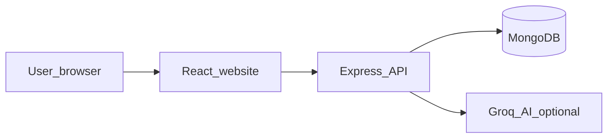
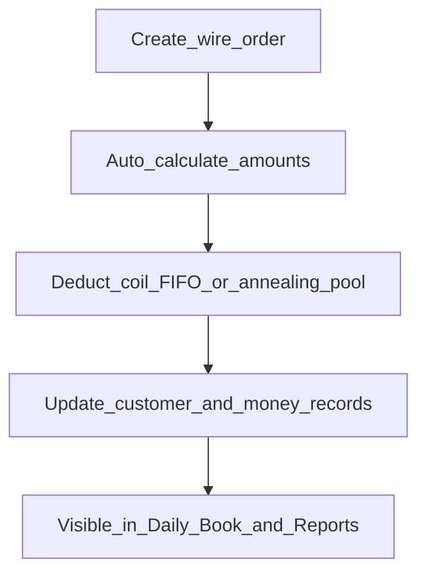

# Wire Manufacturing System (WMS)  
## Complete System Overview for Presentation

**Document purpose:** One self-contained brief you can share with owners, partners, or technical reviewers.  
**Scope:** What the system is, how it works end-to-end, features, security, AI, compatibility, requirements, and how to run or deploy it.  
**Based on:** Live codebase under `WMS/backend` and `WMS/frontend` (not marketing claims).

| Related manuals (optional depth) | Audience |
|----------------------------------|----------|
| `PROJECT_DOCUMENTATION.docx` | Technical written detail |
| `PROJECT_DOCUMENTATION_SIMPLE.docx` | Everyday written guide |
| `PROJECT_VISUAL.docx` | Technical diagrams |
| `PROJECT_VISUAL_SIMPLE.docx` | Everyday diagrams |
| **This document** | **Single presentation pack** |

---

## 1. Executive summary

**WMS** is a full-stack web application for a **coil-to-wire manufacturing business**. It replaces scattered notebooks and spreadsheets with one system for:

- Buying and tracking **coil stock**
- Recording **wire sales (orders)** and customer accounts
- Running a daily **cash / party / annealing / processing** notebook
- Tracking **expenses**, **workers**, **bank**, and **ready wire stock**
- Viewing **dashboard KPIs** and **management reports** (with Excel/PDF export)
- Using an optional **AI assistant** (Ask questions, or Agent mode to enter data after confirmation)

**Architecture in one line:** Browser app (React) ↔ API server (Node/Express) ↔ Database (MongoDB), with optional Groq cloud AI for the chatbot.

---

## 2. Who it is for

| Role | Typical user | What they can do |
|------|----------------|------------------|
| **Admin** | Owner / trusted staff | Full create, edit, delete; AI Agent; manage users; view security logs |
| **Viewer** | Accountant / observer | See all business screens; Ask the AI questions; **cannot** change data or use Agent |

The product is designed for a **factory office** workflow: procurement → production/sales → daily money book → reports.

---

## 3. What the system does (modules)

### 3.1 Procurement and stock

| Capability | Working behavior |
|------------|------------------|
| **Suppliers** | Master list; purchases; ledgers; opening balances |
| **Coil stock (raw materials)** | Shiplet / Patri categories; purchase & return lots; remaining stock |
| **Low stock** | Alert when a category falls under **1000 kg** |
| **Ready stock** | Finished wire on hand (production, surplus, returns) |
| **Stock deduction** | Sales consume coil using **oldest stock first (FIFO)**; if short, sale still saves with **pending stock** and later auto-reconcile when stock arrives |

### 3.2 Sales and parties

| Capability | Working behavior |
|------------|------------------|
| **Customers** | Types: Ledger, Daily, Processing; opening balances; payment history |
| **Orders** | Wire #1–20; statuses **Outer → In Process → Done**; final weight after heating; returns; optional annealed sales |
| **Party linking** | Same person can be linked as Supplier + Processing Customer for combined ledgers |

### 3.3 Daily operations hub

**Daily Book** tabs:

1. Cash Book (opening, in/out, closing, who holds cash)  
2. Daily Customers  
3. Ledger Customers  
4. Suppliers  
5. Annealing (Send / Arrival / Sold pools)  
6. Processing Work (customer’s own coil; labour charged per kg)

Separate **Bank** page for MBL / UBL / Faisal Bank / Other openings and bank book. ATM withdrawals pair bank-out with cash-in.

### 3.4 Costs, labour, reports

| Capability | Working behavior |
|------------|------------------|
| **Expenses** | Groups: Labour, Rental, Operations, Manufacturing, Process Material, Self Expense, factory daily totals |
| **Process materials** | Acid, Dye, Soap, Stationary purchases/usage and intensity analysis |
| **Workers** | Master + salary due / payment / advance / adjustment (payments can create expenses) |
| **Dashboard** | Revenue, expenses, orders, stock signals, charts, activity |
| **Reports** | Profit & Loss (main / processing / combined), Cash & Bank, Inventory, Customer — export Excel/PDF |

### 3.5 Administration

| Capability | Working behavior |
|------------|------------------|
| **User management** | Admins create/update users, reset passwords, deactivate |
| **Security & logs** | Activity audit (create/update/delete/login, etc.) |
| **Session safety** | Idle warning ~1h45m; logout ~2h |
| **Login lockout** | 5 failed attempts → 5-minute lock |

---

## 4. How the whole system works (end-to-end)

### 4.1 Typical operating day

1. Staff **log in** on a browser.  
2. Record **coil purchases** and/or **wire sales**.  
3. Use **Daily Book** for cash, payments, annealing, and processing.  
4. Enter **expenses** / worker payments as needed.  
5. Check **Dashboard** and **Reports** for position and P&amp;L.  
6. Optionally ask the **AI** for lookups, or (admins) confirm Agent actions.

### 4.2 How a sale affects the system

### 4.3 How data stays consistent

- Money rows stay aligned with sales, purchases, and expenses through the API’s sync services.  
- Party totals and ledgers recalculate from source documents.  
- Pending coil shortages can be filled automatically when new stock arrives or when the server starts.  
- Deletes are guarded when history exists (parties cannot be removed carelessly).

### 4.4 AI assistant (how it works)

| Mode | Who | Behavior |
|------|-----|----------|
| **Ask** | Admin + Viewer | Answers from **live database** context; does not change records |
| **Agent** | Admin only | Parses intent → shows **preview** → you **confirm** → saves → optional **Undo** |

AI runs **inside the same API** (not a separate product). It calls **Groq** cloud models when `GROQ_API_KEY` is set. Chat history is kept in the browser, not as a permanent server chat archive.

Agent can draft actions such as: create order, record payment, buy coils, add expense, cash entry, annealing send/arrive, processing delivery, add customer/supplier, ready stock, worker payment, ATM withdrawal, delete or shift date, or answer a read-only query.

---

## 5. Technology stack

| Layer | Technology | Version (from packages) |
|-------|------------|-------------------------|
| Frontend UI | React + Create React App | React **18.2** |
| UI kit | Material UI (MUI) | **5.14** |
| Routing | React Router | **6.21** |
| HTTP client | Axios | **1.6** |
| Charts | Recharts | **2.10** |
| Exports | jsPDF, xlsx | PDF / Excel from browser |
| Backend | Node.js + Express | Express **4.18** |
| ODM / DB | Mongoose + MongoDB | Mongoose **8.0** |
| Auth | JWT + bcrypt | jsonwebtoken **9**, bcryptjs **2.4** |
| AI | Groq SDK | **1.5** (optional key) |

**Application shape:** Two Node apps (`frontend/`, `backend/`) + one MongoDB database. No Redis, no WebSockets, no separate AI microservice required.

---

## 6. Compatibility

### 6.1 Client (users)

| Item | Compatibility |
|------|----------------|
| **Platform** | Any modern desktop or laptop browser (Windows, macOS, Linux). Mobile browsers work for viewing; primary design target is **office desktop**. |
| **Browsers** | Chrome, Edge, Firefox, Safari — current or recent versions (CRA production browserslist: `>0.2%, not dead`). |
| **Network** | Browser must reach the API URL (local network or internet if hosted). |
| **Offline** | Not an offline-first app; needs API + database reachable. |
| **Language** | UI in English; AI Agent accepts English and Urdu-style natural language for intents. |

### 6.2 Server (operators / IT)

| Item | Compatibility |
|------|----------------|
| **Node.js** | **v16+** recommended (v18/v20 LTS preferred for hosting). |
| **OS for API** | Windows, macOS, or Linux (Node is cross-platform). |
| **MongoDB** | Local MongoDB Community **or** MongoDB Atlas (cloud). App uses standard MongoDB URI / Atlas `mongodb+srv`. |
| **Outbound internet** | Required only for **Groq AI**. Core ERP features work without AI if the key is omitted. |
| **HTTPS** | Supported via reverse proxy / host platform (Vercel, Render, nginx, etc.). |

### 6.3 Hosting / deployment compatibility

| Component | Fits free/common hosts | Notes |
|-----------|------------------------|-------|
| Frontend (static CRA build) | **Vercel**, Netlify, Render static, nginx | Set `REACT_APP_API_URL` at **build** time |
| Backend (long-running Express) | **Render**, Railway, VPS, local PC | Not a pure Vercel-serverless app out of the box |
| Database | **MongoDB Atlas** free tier or self-hosted | Atlas network access must allow the API host |
| AI | Groq cloud | Free-tier API key available from Groq |

**Important:** Frontend and backend are **separate deployables**. CORS must allow the frontend origin (`CORS_ORIGIN` on the API).

### 6.4 Data / integration compatibility

| Item | Status |
|------|--------|
| Import from Excel as primary master sync | Not a bulk ERP importer; day-to-day entry is in-app |
| Export | Excel and PDF from reports / ledgers / management exports |
| File uploads / S3 | Not used for core flows |
| Third-party accounting packages | No built-in QuickBooks/Xero connector |
| Multi-company / multi-warehouse | Single factory / single DB design |

---

## 7. Security and access control

| Control | How it works |
|---------|----------------|
| Authentication | Username/password → JWT Bearer token |
| Password storage | bcrypt hashes |
| Authorization | `admin` vs `viewer`; writes blocked for viewers on API and UI |
| Token lifetime | Configurable (`JWT_EXPIRES_IN`, default **7 days**) |
| Brute-force | Lock after **5** fails for **5 minutes** |
| Idle session | Warning then logout (~2 hours idle) |
| Inactive users | Cannot log in |
| Audit | Activity logs for admins |
| Production CORS | Restrict origins via `CORS_ORIGIN` |
| Secrets | Stored in environment variables (never in frontend for JWT secret / Groq key) |

---

## 8. Requirements to run

### 8.1 Minimum to develop or demo locally

1. **Node.js** installed  
2. **MongoDB** local service **or** Atlas URI  
3. Backend `.env` with at least `MONGODB_URI` and `JWT_SECRET`  
4. Optional: `GROQ_API_KEY` for AI  
5. `npm install` in `backend` and `frontend`  
6. Seed users once (`npm run seed` in backend when DB has no users)  
7. Start backend (`npm run dev` / `npm start`) then frontend (`npm start`)

Default local ports: API **5000**, UI **3000**.

### 8.2 Environment variables (summary)

**Backend:** `MONGODB_URI`, `JWT_SECRET`, `JWT_EXPIRES_IN`, `PORT`, `NODE_ENV`, `CORS_ORIGIN`, `GROQ_API_KEY`, optional seed password envs.  

**Frontend:** `REACT_APP_API_URL` (full API base including `/api`).

### 8.3 Seed accounts (first empty database)

| Username | Role | Password source |
|----------|------|-----------------|
| `admin`, `dad`, `uncle` | admin | `SEED_ADMIN_PASSWORD` (default `change-me-admin`) |
| `viewer` | viewer | `SEED_VIEWER_PASSWORD` (default `change-me-viewer`) |

**Change these immediately** on any shared or public deployment.

---

## 9. Screens map (what you show in a demo)

| Route | Screen | Demo talking point |
|-------|--------|--------------------|
| `/login` | Login | Roles and lockout |
| `/dashboard` | Dashboard | Live KPIs and charts |
| `/suppliers` | Suppliers | Procurement master |
| `/raw-materials` | Coil stock | Purchases and remaining kg |
| `/low-stock` | Low stock | Under 1000 kg warning |
| `/customers` | Customers | Ledger / Daily / Processing |
| `/orders` | Orders | Sale lifecycle and stock |
| `/daily-book` | Daily Book | Day’s ops center |
| `/bank` | Bank | Bank openings and book |
| `/expenses` | Expenses | Cost groups + process materials |
| `/workers` | Workers | Labour ledger |
| `/ready-stock` | Ready stock | Finished wire |
| `/reports` | Reports | P&amp;L and exports |
| `/users` | Users | Admin only |
| `/security` | Security logs | Admin only |
| (FAB) | AI Assistant | Ask vs Agent |

---

## 10. Strengths and honest limits (for stakeholders)

### Strengths

- Covers the **real factory loop**: coils → wire sales → daily money → reports  
- **Role-based** access (view-only vs full control)  
- **AI helper** grounded in live data, with confirmation before Agent writes  
- Works on **standard web stack**; deployable on common free/paid cloud hosts  
- Exports for management review (Excel/PDF)

### Limits to set expectations

- Free cloud API hosts may **sleep** (cold start delay) unless upgraded  
- Designed for **one factory database**, not multi-tenant SaaS out of the box  
- AI quality depends on Groq availability and clear user prompts; Agent still needs human confirmation  
- Best on desktop browsers; mobile is usable but not the primary layout target  
- No built-in accounting-package sync or offline mode

---

## 11. Suggested presentation flow (10–15 minutes)

1. **Problem:** factory needed one system for stock, sales, cash, and reports.  
2. **Solution diagram:** browser → API → MongoDB (+ optional AI).  
3. **Live walkthrough:** Dashboard → Orders → Daily Book → Reports.  
4. **Stock story:** FIFO + pending stock + low stock.  
5. **Roles:** Admin vs Viewer.  
6. **AI:** Ask a question; optionally show Agent preview (do not execute live on production data without care).  
7. **Compatibility:** Node + Mongo + modern browsers; hosting options.  
8. **Close:** where Word manuals live for deeper review.

---

## 12. Document pack checklist

| Deliverable | Location |
|-------------|----------|
| This overview (Word) | `docs-export/out/PROJECT_SYSTEM_OVERVIEW.docx` |
| Technical written | `docs-export/out/PROJECT_DOCUMENTATION.docx` |
| Simple written | `docs-export/out/PROJECT_DOCUMENTATION_SIMPLE.docx` |
| Technical visual | `docs-export/out/PROJECT_VISUAL.docx` |
| Simple visual | `docs-export/out/PROJECT_VISUAL_SIMPLE.docx` |

Markdown sources live at the `WMS/` root; regenerate Word with `npm run export` inside `WMS/docs-export`.

---

## 13. One-page fact sheet

| Fact | Value |
|------|-------|
| Product name | Wire Manufacturing System (WMS) |
| Type | Full-stack web ERP-style factory app |
| Frontend | React 18 + MUI 5 SPA |
| Backend | Node.js Express REST API |
| Database | MongoDB (Mongoose) |
| Auth | JWT + bcrypt; admin / viewer RBAC |
| AI | Groq-powered Ask + Agent (optional) |
| Core domains | Suppliers, coils, customers, orders, daily book, bank, expenses, workers, ready stock, reports |
| Client needs | Modern browser + network to API |
| Server needs | Node 16+, MongoDB URI, env secrets |
| Deploy pattern | Static frontend + Node API + Atlas/local Mongo |
| Exports | Excel, PDF |
| License | Private / project use |

---

*End of system overview. For field-level and API-level detail, use the technical documentation manuals.*
