# WMS — Project Visual Documentation

Generated from the actual codebase under `WMS/backend` and `WMS/frontend/src`.  
Diagrams use Mermaid. Only relationships and flows found in source are shown.

**Note:** There is no function named `syncToDailyBook`. Daily Book sync uses symbols such as `createDailyBookExpenseTotal`, `syncTransactionFromOrder`, `syncTransactionFromRawMaterial`, `syncSourceFromTransaction`, `cascadeDeleteSource`, and `recalcCustomerTotals` / `recalcSupplierTotals` in `transactionSyncService.js`.

---

## 1. System Architecture

How the React SPA, Express API, and MongoDB connect in code.

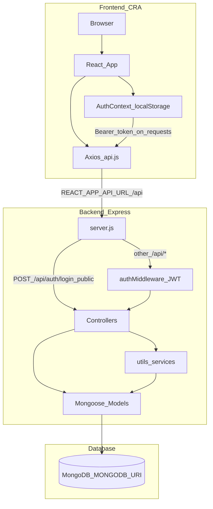

**From code:**

- Frontend base URL: `process.env.REACT_APP_API_URL || 'http://localhost:5000/api'` in `frontend/src/services/api.js`
- Backend mounts routes in `backend/server.js`; connects via `config/db.js` using `MONGODB_URI`
- JWT stored in `localStorage` (`token`); Axios interceptor attaches `Authorization: Bearer …`

---

## 2. Database Diagram

All 16 Mongoose collections with key fields and real `ref` / `refPath` relationships.

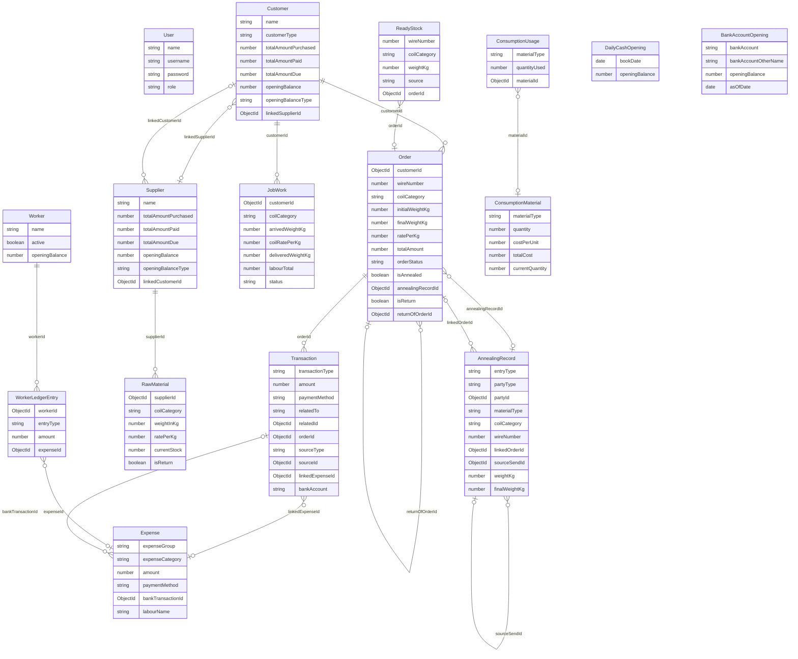

**Soft links (ObjectId without schema `ref`):**

- `Transaction.relatedId` → Customer or Supplier `_id` when `relatedTo` is set
- `Transaction.sourceId` → Expense / Order / RawMaterial / ConsumptionMaterial matching `sourceType`
- `AnnealingRecord.partyId` uses `refPath: 'partyType'` (`Supplier` | `Customer` | `None`)
- `AnnealingRecord.autoAllocationId` groups auto-split mixed arrivals

---

## 3. User Flow

Every route in `App.jsx` and sidebar navigation in `Sidebar.jsx`.

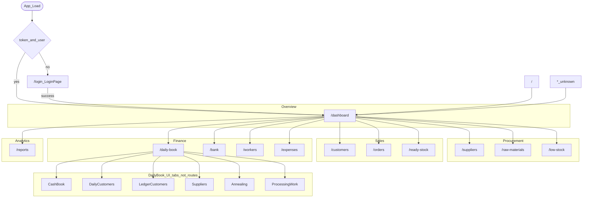

All routes except `/login` wrap `ProtectedRoute` + `AppLayout`.

---

## 4. All Module Connections

Arrows only where one module writes to or recalculates another in controllers/utils.

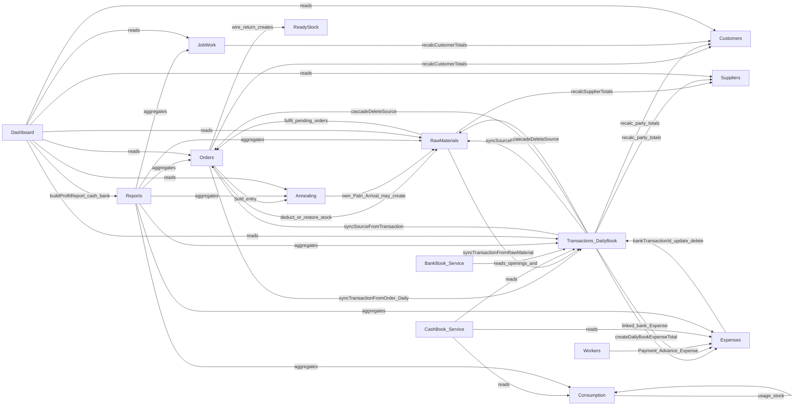

---

## 5. Daily Book Sync Diagram

Based on real sync helpers (not a `syncToDailyBook` function).

```mermaid
flowchart TB
  UI[DailyBook.jsx]

  subgraph apis [APIs_called_from_DailyBook]
    OrdAPI[ordersAPI]
    TxnAPI[transactionsAPI]
    RawAPI[rawMaterialsAPI]
    AnnAPI[annealingAPI]
    JobAPI[jobWorkAPI]
    PartyAPI[customersAPI_suppliersAPI]
    RepAPI[reportsAPI_via_ReportDialog]
  end

  UI --> OrdAPI
  UI --> TxnAPI
  UI --> RawAPI
  UI --> AnnAPI
  UI --> JobAPI
  UI --> PartyAPI
  UI --> RepAPI

  subgraph writePaths [Write_side_effects]
    OrdCreate[Order_create]
    DailyTxn[syncTransactionFromOrder_MoneyIn]
    AnnSold[Annealing_Sold]
    CustTot[recalcCustomerTotals]

    TxnCreate[Transaction_create]
    ExpTotal[createDailyBookExpenseTotal]
    ATM[ATMWithdrawal_BankOut_plus_Expense]
    BankExp[createLinkedExpenseForBankTransfer]
    PartyTot[recalcCustomer_or_SupplierTotals]

    RawCreate[RawMaterial_create_or_return]
    SupTot[recalcSupplierTotals]
    PayTxn[syncTransactionFromRawMaterial]

    JobDel[JobWork_delivery]
    AnnArr[Annealing_Arrival]
  end

  OrdAPI --> OrdCreate
  OrdCreate --> DailyTxn
  OrdCreate --> AnnSold
  OrdCreate --> CustTot

  TxnAPI -->|"entryKind_Factory_or_SelfExpense"| ExpTotal
  TxnAPI -->|"entryKind_ATMWithdrawal"| ATM
  TxnAPI -->|"normal_plus_recordAsExpense"| BankExp
  TxnAPI --> TxnCreate
  TxnCreate --> PartyTot

  RawAPI --> RawCreate
  RawCreate --> PayTxn
  RawCreate --> SupTot

  JobAPI --> JobDel
  JobDel --> CustTot

  AnnAPI --> AnnArr
  AnnArr -->|"own_Patri_Coil"| RawCreate

  subgraph reverseSync [Reverse_and_delete]
    TxnUpd[Transaction_update]
    SyncSrc[syncSourceFromTransaction]
    TxnDel[Transaction_delete]
    Casc[cascadeDeleteSource]
    DelLink[deleteLinkedExpenseForBankTransfer]
  end

  TxnAPI --> TxnUpd
  TxnUpd --> SyncSrc
  SyncSrc --> OrdCreate
  SyncSrc --> RawCreate
  SyncSrc --> ExpTotal
  TxnAPI --> TxnDel
  TxnDel -->|"Bank_Transfer"| DelLink
  TxnDel -->|"non_bank"| Casc

  subgraph reads [Read_aggregation]
    Cash[cashBookService]
    Bank[bankBalanceService]
    Ledger[ledgerService]
    DBRep[dailyBookReportService]
  end

  TxnAPI -->|"getCashBook"| Cash
  TxnAPI -->|"getBankBook"| Bank
  PartyAPI -->|"getLedger"| Ledger
  RepAPI --> DBRep
  Cash -->|"Transactions_excl_Expense_Consumption_sources"| TxnCreate
  Cash -->|"Expense_and_Consumption_totals_skip_BankTransfer"| ExpTotal
```

**Two-way behaviour found in code:**

| Direction | Mechanism |
|-----------|-----------|
| Source → Daily Book / Transaction | `syncTransactionFromOrder`, `syncTransactionFromRawMaterial`, manual `POST /transactions` |
| Daily Book expense totals → Expense | `createDailyBookExpenseTotal` (no Transaction row) |
| Transaction → source | `syncSourceFromTransaction` on update |
| Transaction delete → source / Expense | `cascadeDeleteSource` or `deleteLinkedExpenseForBankTransfer` |
| Cash book read | Merges Transactions + Expense + ConsumptionMaterial; Bank Transfer expenses excluded from cash out |

---

## 6. Expense Structure Tree

Exact tree from `backend/utils/wireConfig.js` → `EXPENSE_CATEGORY_TREE`.

```mermaid
flowchart TD
  Root[Expense_Categories]

  Root --> Labour
  Labour --> LS[Labour_Salary]
  Labour --> LA[Labour_Advance]
  Labour --> LT[Labour_Tea]
  Labour --> LF[Labour_Food]
  Labour --> PL[Petrol_Labour]
  Labour --> LM[Miscellaneous]

  Root --> Rental
  Rental --> CR[Coil_Rental]
  Rental --> WR[Wire_Rental]
  Rental --> RM[Miscellaneous]

  Root --> Operations
  Operations --> WS[Weight_Scale_Payment]
  Operations --> HM[Hardware_Maintenance]
  Operations --> EL[Electricity]
  Operations --> OE[Office_Expense]
  Operations --> OM[Miscellaneous]

  Root --> Manufacturing
  Manufacturing --> AN[Annealing]
  Manufacturing --> MM[Miscellaneous]

  Root --> SelfExpense[Self_Expense]
  SelfExpense --> Fayyaz[Fayyaz_Expense]
  SelfExpense --> Faisal[Faisal_Expense]
  SelfExpense --> Mutual[Mutual_Expense]

  Root --> FactoryTotal[Factory_Expense_Total]
  FactoryTotal --> DailyTotal[Daily_Total]

  Root --> ProcessMaterial[Process_Material]
  ProcessMaterial --> Acid
  ProcessMaterial --> Dye
  ProcessMaterial --> Soap
  ProcessMaterial --> Stationary
  ProcessMaterial --> PM[Miscellaneous]
```

**Also in enum (legacy):** Salary, Bills, Maintenance, Manufacturing, Other.

**Rules from code:**

- `FACTORY_EXPENSE_GROUPS` = Labour, Rental, Operations, Manufacturing, Process Material
- Process Material **cannot** be created via Expense API (must use Consumption / Process Material stock)
- Worker Payment → Labour / Labour Salary; Advance → Labour / Labour Advance
- Rental may also store `coilType` and `rentalRoute` on Expense documents

---

## 7. Order Lifecycle Flowchart

States and triggers from `Order` model and `orderController.js`.

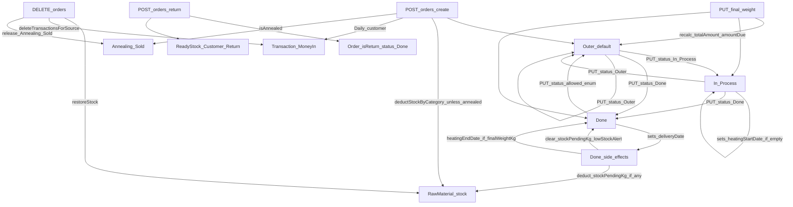

Valid status enum: `Outer` | `In Process` | `Done` (validated in `updateOrderStatus`).

---

## 8. Profit and Loss Calculation Diagram

From `backend/utils/profitReportService.js` → `buildProfitReport`.

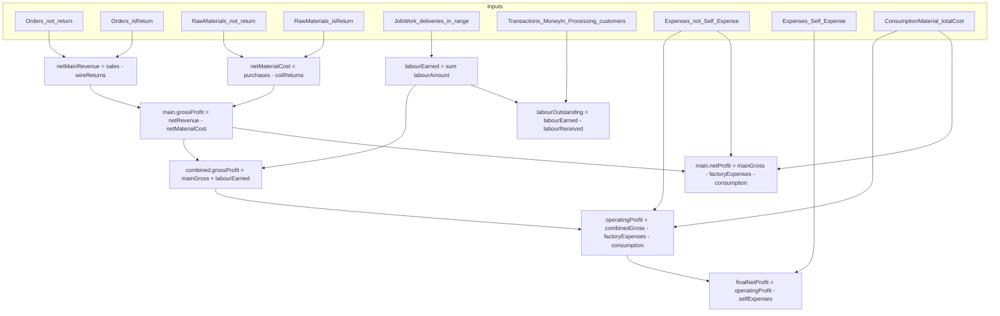

**Scopes returned in code:** `main`, `processing`, `combined` (plus annealing informational rows/pools).

---

## 9. Raw Material Mapping

From `backend/utils/wireConfig.js` defaults; coil category can be overridden on order/sale/production.

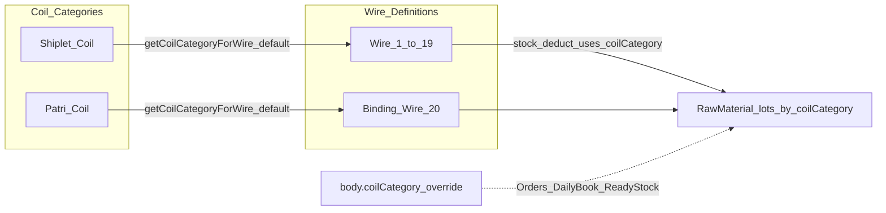

**Stock rules in `stockService.js`:**

- Deduct FIFO within chosen `coilCategory` (`purchaseDate` ascending)
- Low stock threshold: category total &lt; 1000 kg

**Consumption materials (separate from coils):** Acid, Dye, Soap, Stationary.

---

## 10. Frontend Component Tree

Hierarchy from `index.js`, `App.jsx`, and page imports.

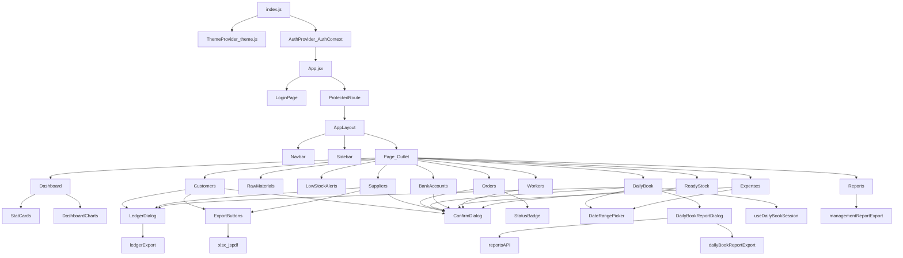

Shared API layer: all pages (except Login via AuthContext) use `services/api.js`.

---

## 11. API Routes Map

Mounts from `server.js`. **Public** = no JWT. **Protected** = `authMiddleware` on the mount (or route-level for auth profile/password).

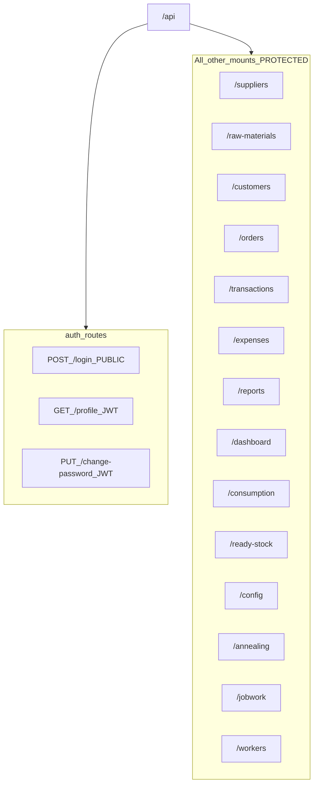

### Endpoints by module

| Module | Auth | Endpoints |
|--------|------|-----------|
| **auth** | Public: login; JWT: profile, change-password | `POST /login`, `GET /profile`, `PUT /change-password` |
| **suppliers** | Protected | `GET/POST /`, `GET/PUT/DELETE /:id`, `GET /:id/ledger`, `GET /:id/purchases` |
| **raw-materials** | Protected | `GET /`, `POST /`, `PUT/DELETE /:id`, `GET /stock-summary`, `GET /low-stock`, `POST /reconcile-pending`, `POST /return` |
| **customers** | Protected | `GET/POST /`, `GET/PUT/DELETE /:id`, `GET /:id/orders`, `GET /:id/payment-history`, `GET /:id/ledger`, `POST /:id/add-payment` |
| **orders** | Protected | `GET/POST /`, `GET/PUT/DELETE /:id`, `GET /check-stock`, `GET /by-status/:status`, `POST /return`, `PUT /:id/status`, `PUT /:id/final-weight` |
| **transactions** | Protected | `GET/POST /`, `GET/PUT/DELETE /:id`, `GET /summary`, `GET /daily/:date`, `GET /cashbook`, `POST /cashbook/opening`, `GET /cashbook/previous-closing`, `GET /bank-book`, `GET /bank-persons`, `GET/POST /bank-book/opening` |
| **expenses** | Protected | `GET/POST /`, `PUT/DELETE /:id`, `GET /summary`, `GET /breakdown` |
| **reports** | Protected | `GET /profit-loss`, `GET /financial`, `GET /customer/:id`, `GET /inventory`, `GET /daily-book` |
| **dashboard** | Protected | `GET /stats`, `GET /charts` |
| **consumption** | Protected | `GET /analysis`, `GET /stock`, `GET/POST /materials`, `PUT/DELETE /materials/:id`, `GET/POST /usage` |
| **ready-stock** | Protected | `GET /`, `GET /summary`, `POST /`, `DELETE /:id` |
| **config** | Protected | `GET /wires` |
| **annealing** | Protected | `GET /`, `POST /`, `POST /arrival`, `GET /summary`, `GET /pending`, `PUT/DELETE /:id` |
| **jobwork** | Protected | `GET /`, `POST /`, `GET /stock`, `GET /pools`, `POST /pool-deliver`, `POST /:id/delivery`, `PUT/DELETE /:id/delivery/:deliveryId`, `PUT/DELETE /:id` |
| **workers** | Protected | `GET/POST /`, `GET/PUT/DELETE /:id`, `GET /:id/ledger`, `POST /:id/entries`, `PUT/DELETE /:id/entries/:entryId` |

---

## Connections Summary

Plain English cross-module links found in the code:

1. When an **Order is created** → **RawMaterial stock is reduced** because `deductStockByCategory` runs (unless the sale is annealed).
2. When an **Order is created for a Daily customer** → a **Transaction Money In** is created because `syncTransactionFromOrder` runs.
3. When an **annealed Order is created** → an **Annealing Sold** record is created and linked because the order controller writes annealing consumption.
4. When an **Order is created/updated/deleted or final weight changes** → **Customer totals** update because `recalcCustomerTotals` is called.
5. When an **Order is deleted** → **stock is restored**, **Order-sourced Transactions are deleted**, and **Annealing Sold is released** via delete helpers in the order controller / sync service.
6. When a **wire return** is posted → a **return Order** and a **ReadyStock (Customer Return)** row are created, then customer totals recalculate.
7. When a **RawMaterial purchase** is created with `amountPaid > 0` → a **Transaction Money Out** to the supplier is synced via `syncTransactionFromRawMaterial`.
8. When a **RawMaterial purchase/return** happens → **Supplier totals** recalculate via `recalcSupplierTotals`.
9. When **coil stock increases** → **pending Orders may be fulfilled** because `stockService` reconcile / fulfil logic runs (also on server startup).
10. When **Daily Book records FactoryExpense or SelfExpense** → an **Expense day total** is upserted via `createDailyBookExpenseTotal` and **no Transaction row** is created for that path.
11. When **Daily Book records ATMWithdrawal** → a **Bank Transfer Money Out Transaction** and a **linked Self Expense** are created.
12. When a **bank transfer Transaction is saved with recordAsExpense** → a **linked Expense** is created/updated via `createLinkedExpenseForBankTransfer` / sync helpers.
13. When a **Transaction related to Customer/Supplier is created/updated/deleted** → **party totals** recalculate.
14. When a **Transaction is updated** → the **source Order / RawMaterial / Expense / ConsumptionMaterial** may update because `syncSourceFromTransaction` runs.
15. When a **non-bank Transaction is deleted** → the **source document may be cascade-deleted** via `cascadeDeleteSource`.
16. When a **bank Transaction is deleted** → its **linked Expense is deleted** via `deleteLinkedExpenseForBankTransfer`.
17. When an **Expense with bankTransactionId is updated/deleted** → the **linked Transaction** may be updated or removed in the expense controller.
18. When a **JobWork delivery is added/updated/deleted** → **Customer totals** recalculate (labour receivable).
19. When an **Annealing Arrival of own Patri Coil** completes → a **RawMaterial factory lot** may be created in the annealing controller.
20. When a **Worker Payment or Advance entry** is saved → an **Expense** (Labour Salary / Labour Advance) is created or updated and stored on `expenseId`.
21. When a **Worker entry is changed away from Payment/Advance or deleted** → the **linked Expense is deleted**.
22. When a **Customer and Supplier are linked** → both `linkedSupplierId` and `linkedCustomerId` are set bidirectionally via `partyLinkService`.
23. When the **cash book is read** → it combines **Transactions** (excluding Expense/ConsumptionMaterial sources) with **Expense and ConsumptionMaterial totals**, skipping Bank Transfer expenses for cash out.
24. When the **bank book is read** → it uses **BankAccountOpening** plus **Bank Transfer Transactions** via `bankBalanceService`.
25. When **Reports / Dashboard profit stats** run → they call **`buildProfitReport`**, which aggregates Orders, RawMaterials, JobWork, Expenses, ConsumptionMaterial, and Processing payments.
26. When the **server starts** → **`reconcileAllPendingOrders`** runs so historical pending stock can be fulfilled after DB connect.
