# WMS — Simple Visual Guide

Pictures of how the factory software works, with everyday labels.  
For technical diagram labels, see `PROJECT_VISUAL.md`. For full written explanation, see `PROJECT_DOCUMENTATION_SIMPLE.md`.

---

## 1. Big picture — how the system is put together

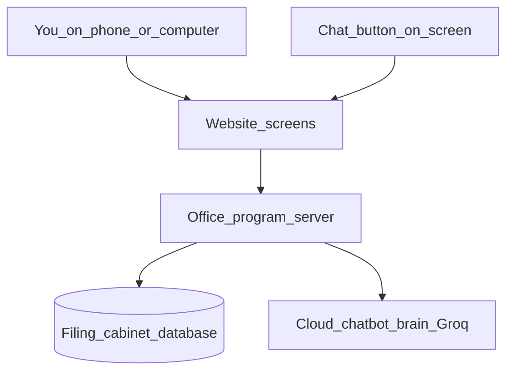

**In plain words:** You use the website. The website asks the office program. The office program keeps records in the database. The chatbot also goes through the office program — there is no separate AI computer to deploy.

---

## 2. Login and permissions

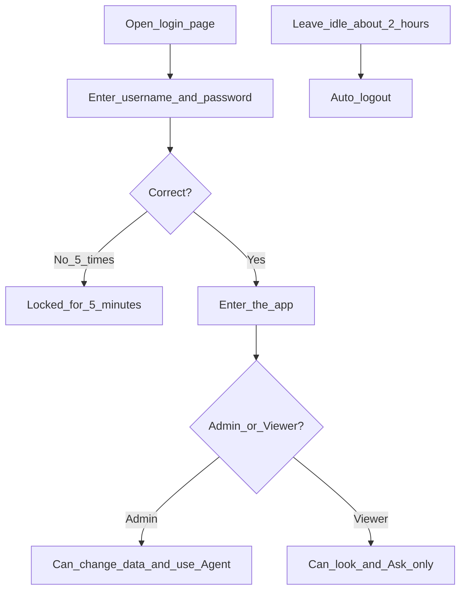

---

## 3. What the main screens cover

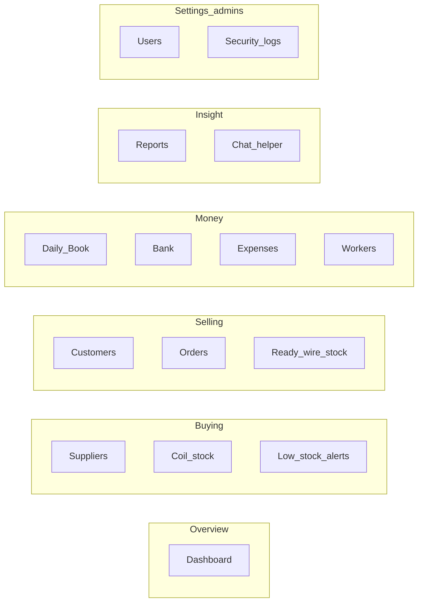

---

## 4. Buying coils → making / selling wire → money

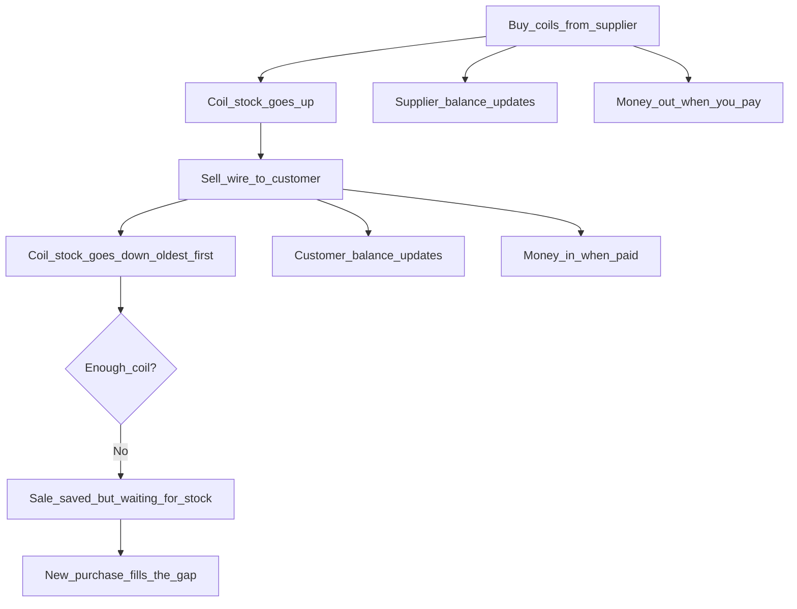

---

## 5. Order stages (customer sale)

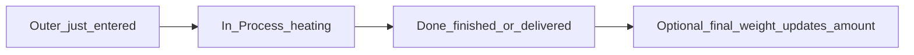

---

## 6. Daily Book — today’s notebook

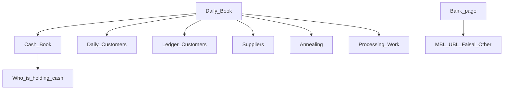

**Plain meaning:** One place for today’s cash, customers, suppliers, annealing, and processing work. Bank details also live on the Bank page.

---

## 7. Annealing in three steps

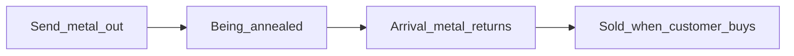

---

## 8. Processing work (customer’s own coil)

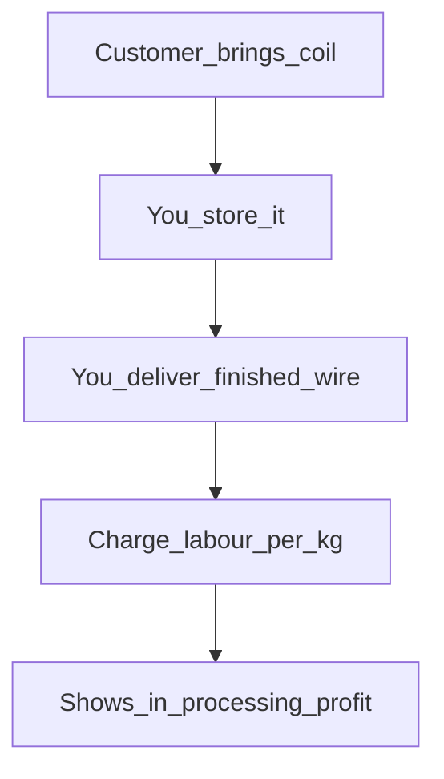

---

## 9. How money records connect

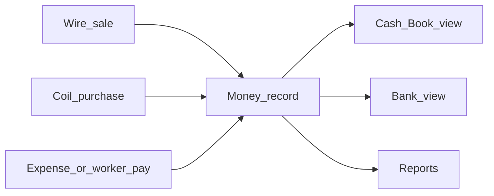

---

## 10. Chatbot: Ask vs Agent

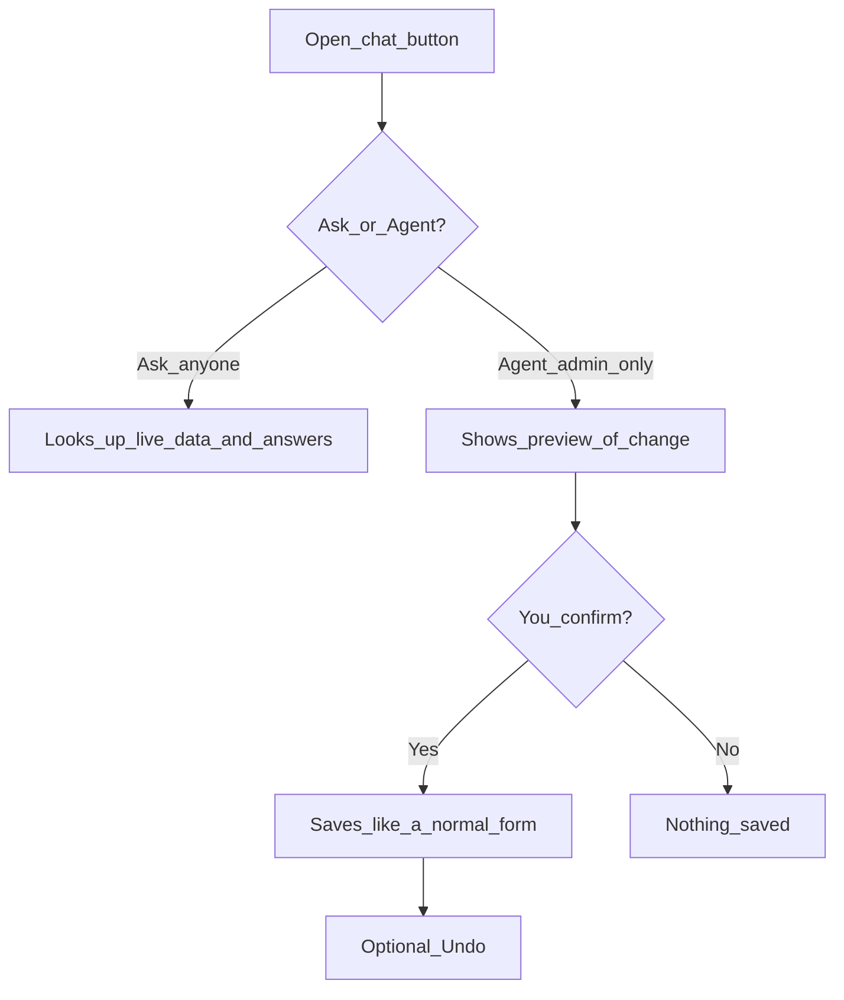

**Remember:** Ask = answers only. Agent = can change data after you say yes.

---

## 11. Who talks to whom (simple map)

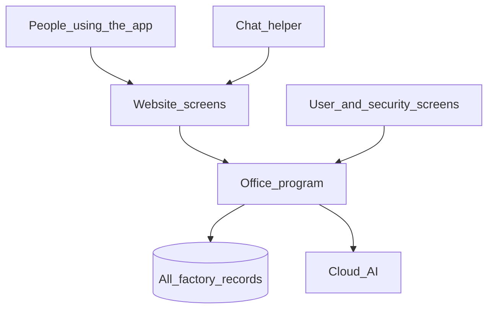

---

## 12. Reports at a glance

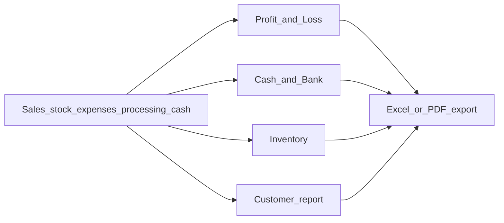

---

## How to read these pictures

- Boxes are steps or screens.  
- Arrows mean “leads to” or “updates”.  
- Admin-only paths are called out in the login and chatbot diagrams.  
- Nothing here invents features — it mirrors the live WMS app.
